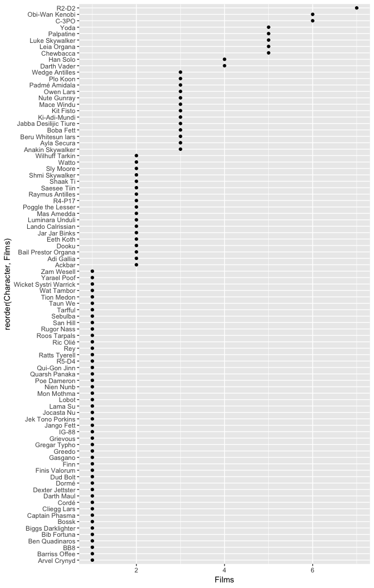

Day 1 Case Study Solutions
================

## Project set up

1.  Create a new project for this case study. Name it whatever you’d
    like.

2.  Create a new .Rmd report. You can copy the text from this file into
    your .Rmd file and add your own notes and code as you see fit.

3.  Copy the `Month-XX.csv` files from your class folder (or yesterday’s
    project) to this project location.

4.  Load the **tidyverse** and **repurrrsive**\_ packages. The
    **repurrrsive** package provides some data sets we’ll use later in
    this case study.

<!-- end list -->

``` r
library(tidyverse)
library(repurrrsive)
```

## Analysis questions

5.  Import the `Month-XX.csv` files into your current R session. Do so
    using a `for` loop or ***purrr***. Rather than have 11 separate data
    frames (one for each month), combines these so that you have one
    data frame containing all the data. You final data frame should have
    698,159 rows and 10 columns.

<!-- end list -->

``` r
# import all data files into one data frame titled "df"
df <- list.files("../data") %>%
  paste0("../data/", .) %>%
  map_dfr(read_csv)

glimpse(df)
## Observations: 698,159
## Variables: 10
## $ Account_ID            <int> 5, 16, 28, 40, 62, 64, 69, 69, 70, 79, 88,…
## $ Transaction_Timestamp <dttm> 2009-01-08 00:16:41, 2009-01-20 22:40:08,…
## $ Factor_A              <int> 2, 2, 2, 2, 2, 7, 2, 2, 2, 7, 8, 10, 10, 2…
## $ Factor_B              <int> 6, 6, 6, 6, 6, 6, 6, 6, 6, 6, 18, 6, 6, 6,…
## $ Factor_C              <chr> "VI", "VI", "VI", "VI", "VI", "MC", "VI", …
## $ Factor_D              <int> 20, 20, 21, 20, 20, 20, 20, 20, 20, 20, 20…
## $ Factor_E              <chr> "A", "H", "NULL", "H", "B", "NULL", "H", "…
## $ Response              <int> 1020, 1020, 1020, 1020, 1020, 1020, 1020, …
## $ Transaction_Status    <chr> "Approved", "Approved", "Approved", "Appro…
## $ Month                 <chr> "Jan", "Jan", "Jan", "Jan", "Jan", "Jan", …
```

6.  Check the current class of each column i.e.
    (`class(df$Account_ID)`). Since the time stamp variable has two
    classes, you can’t condense this down to an atomic vector.

<!-- end list -->

``` r
df %>% map(class)
## $Account_ID
## [1] "integer"
## 
## $Transaction_Timestamp
## [1] "POSIXct" "POSIXt" 
## 
## $Factor_A
## [1] "integer"
## 
## $Factor_B
## [1] "integer"
## 
## $Factor_C
## [1] "character"
## 
## $Factor_D
## [1] "integer"
## 
## $Factor_E
## [1] "character"
## 
## $Response
## [1] "integer"
## 
## $Transaction_Status
## [1] "character"
## 
## $Month
## [1] "character"
```

7.  How many unique values exists in each column?

<!-- end list -->

``` r
df %>% map_int(n_distinct)
##            Account_ID Transaction_Timestamp              Factor_A 
##                475413                686538                     7 
##              Factor_B              Factor_C              Factor_D 
##                     6                     4                    15 
##              Factor_E              Response    Transaction_Status 
##                    63                    42                     2 
##                 Month 
##                    11
```

8.  Use `mutate()` and `ifelse()` (or `if_else()`) to modify the
    `Factor_A` variable. Change those observations that have the
    following values to:

| Current values | Change to |
| :------------: | :-------: |
|  `0, 2, 7, 8`  |   “low”   |
|  `10, 15, 16`  |  “high”   |

``` r
df <- df %>%
  mutate(Factor_A = if_else(Factor_A %in% c(0, 2, 7, 8), "low", "high"))

glimpse(df)
## Observations: 698,159
## Variables: 10
## $ Account_ID            <int> 5, 16, 28, 40, 62, 64, 69, 69, 70, 79, 88,…
## $ Transaction_Timestamp <dttm> 2009-01-08 00:16:41, 2009-01-20 22:40:08,…
## $ Factor_A              <chr> "low", "low", "low", "low", "low", "low", …
## $ Factor_B              <int> 6, 6, 6, 6, 6, 6, 6, 6, 6, 6, 18, 6, 6, 6,…
## $ Factor_C              <chr> "VI", "VI", "VI", "VI", "VI", "MC", "VI", …
## $ Factor_D              <int> 20, 20, 21, 20, 20, 20, 20, 20, 20, 20, 20…
## $ Factor_E              <chr> "A", "H", "NULL", "H", "B", "NULL", "H", "…
## $ Response              <int> 1020, 1020, 1020, 1020, 1020, 1020, 1020, …
## $ Transaction_Status    <chr> "Approved", "Approved", "Approved", "Appro…
## $ Month                 <chr> "Jan", "Jan", "Jan", "Jan", "Jan", "Jan", …
```

9.  Create a function that converts monthly values to quarters. Do it
    such that:

<!-- end list -->

  - Jan-Mar = Q1
  - Apr-Jun = Q2
  - Jul-Sep = Q3
  - Oct-Dec = Q4

Be sure to include a `stop()` error in the function that stops execution
if the input is not a character atomic vector. Also, think about how you
want to deal with NAs or entries that are not a missing value.

``` r
convert_to_qtr <- function(x) {
  
  # make sure x is a character atomic vector
  stopifnot(is.atomic(x), is.character(x))
  
  dplyr::case_when(
    x %in% c("Jan", "Feb", "Mar") ~ "Q1",
    x %in% c("Apr", "May", "Jun") ~ "Q2",
    x %in% c("Jul", "Aug", "Sep") ~ "Q3",
    x %in% c("Oct", "Nov", "Dec") ~ "Q4", 
    TRUE                          ~ NA_character_
  )
}
```

10. Use the function you created above in a `mutate()` statement to
    create a new variable called “Qtr” in the **df** data frame.

<!-- end list -->

``` r
df <- df %>%
  mutate(Qtr = convert_to_qtr(Month))

glimpse(df)
## Observations: 698,159
## Variables: 11
## $ Account_ID            <int> 5, 16, 28, 40, 62, 64, 69, 69, 70, 79, 88,…
## $ Transaction_Timestamp <dttm> 2009-01-08 00:16:41, 2009-01-20 22:40:08,…
## $ Factor_A              <chr> "low", "low", "low", "low", "low", "low", …
## $ Factor_B              <int> 6, 6, 6, 6, 6, 6, 6, 6, 6, 6, 18, 6, 6, 6,…
## $ Factor_C              <chr> "VI", "VI", "VI", "VI", "VI", "MC", "VI", …
## $ Factor_D              <int> 20, 20, 21, 20, 20, 20, 20, 20, 20, 20, 20…
## $ Factor_E              <chr> "A", "H", "NULL", "H", "B", "NULL", "H", "…
## $ Response              <int> 1020, 1020, 1020, 1020, 1020, 1020, 1020, …
## $ Transaction_Status    <chr> "Approved", "Approved", "Approved", "Appro…
## $ Month                 <chr> "Jan", "Jan", "Jan", "Jan", "Jan", "Jan", …
## $ Qtr                   <chr> "Q1", "Q1", "Q1", "Q1", "Q1", "Q1", "Q1", …
```

11. Unfortunately, some of the “Factor\_” variables have observations
    that contain the value “NULL” (they are recorded as a character
    string, not the actual `NULL` value.  
    Use `filter_at()` to filter out any of these observations. Your
    resulting data frame should have 489,537 rows after filtering.

<!-- end list -->

``` r
df <- df %>%
  filter_at(vars(contains("Factor")), all_vars(. != "NULL"))

glimpse(df)
## Observations: 489,537
## Variables: 11
## $ Account_ID            <int> 5, 16, 40, 62, 69, 69, 70, 95, 101, 101, 1…
## $ Transaction_Timestamp <dttm> 2009-01-08 00:16:41, 2009-01-20 22:40:08,…
## $ Factor_A              <chr> "low", "low", "low", "low", "low", "low", …
## $ Factor_B              <int> 6, 6, 6, 6, 6, 6, 6, 6, 6, 6, 6, 6, 6, 6, …
## $ Factor_C              <chr> "VI", "VI", "VI", "VI", "VI", "VI", "VI", …
## $ Factor_D              <int> 20, 20, 20, 20, 20, 20, 20, 20, 20, 20, 20…
## $ Factor_E              <chr> "A", "H", "H", "B", "H", "H", "B", "G", "G…
## $ Response              <int> 1020, 1020, 1020, 1020, 1020, 1020, 1020, …
## $ Transaction_Status    <chr> "Approved", "Approved", "Approved", "Appro…
## $ Month                 <chr> "Jan", "Jan", "Jan", "Jan", "Jan", "Jan", …
## $ Qtr                   <chr> "Q1", "Q1", "Q1", "Q1", "Q1", "Q1", "Q1", …
```

12. The “Factor\_D” variable contains 15 unique values (i.e. 10, 15, 20,
    21, …, 85, 90). There is at least one single observation where
    `Factor_D = 26` (possibly more). Assume these observations were
    improperly recorded and, in fact, the value should be 25.

Using `ifelse()` (or **dplyr**’s `if_else()`) inside `mutate()`, recode
any values where `Factor_D == 26` to be 25.

``` r
# unique values of Factor D before being re-coded
sort(unique(df$Factor_D))
##  [1] 10 15 20 21 25 26 30 35 40 50 55 70 90

# recode Factor D
df <- df %>%
  mutate(Factor_D = if_else(Factor_D == 26L, 25L, Factor_D))

# unique values of Factor D after being re-coded
sort(unique(df$Factor_D))
##  [1] 10 15 20 21 25 30 35 40 50 55 70 90
```

13. Using the `sw_people` data set in the **repurrrsive** package, find
    the number of films each Star Wars characters appears in.

<!-- end list -->

``` r
sw_people %>% map_int(~ length(.x$films))
##  [1] 5 6 7 4 5 3 3 1 1 6 3 2 5 4 1 3 3 1 5 5 3 1 1 2 1 2 1 1 1 1 1 3 1 2 1
## [36] 1 1 2 1 1 2 1 1 3 1 1 1 3 3 3 2 2 2 1 3 2 1 1 1 2 2 1 1 2 2 1 1 1 1 1
## [71] 1 1 2 1 1 2 1 1 2 2 1 1 1 1 1 1 3
```

14. Using the same data and approach, extract the name of each Star Wars
    character. Hint: the first element of each list item is the
    characters name.

<!-- end list -->

``` r
sw_people %>% map_chr(~ .x[[1]])
##  [1] "Luke Skywalker"        "C-3PO"                
##  [3] "R2-D2"                 "Darth Vader"          
##  [5] "Leia Organa"           "Owen Lars"            
##  [7] "Beru Whitesun lars"    "R5-D4"                
##  [9] "Biggs Darklighter"     "Obi-Wan Kenobi"       
## [11] "Anakin Skywalker"      "Wilhuff Tarkin"       
## [13] "Chewbacca"             "Han Solo"             
## [15] "Greedo"                "Jabba Desilijic Tiure"
## [17] "Wedge Antilles"        "Jek Tono Porkins"     
## [19] "Yoda"                  "Palpatine"            
## [21] "Boba Fett"             "IG-88"                
## [23] "Bossk"                 "Lando Calrissian"     
## [25] "Lobot"                 "Ackbar"               
## [27] "Mon Mothma"            "Arvel Crynyd"         
## [29] "Wicket Systri Warrick" "Nien Nunb"            
## [31] "Qui-Gon Jinn"          "Nute Gunray"          
## [33] "Finis Valorum"         "Jar Jar Binks"        
## [35] "Roos Tarpals"          "Rugor Nass"           
## [37] "Ric Olié"              "Watto"                
## [39] "Sebulba"               "Quarsh Panaka"        
## [41] "Shmi Skywalker"        "Darth Maul"           
## [43] "Bib Fortuna"           "Ayla Secura"          
## [45] "Dud Bolt"              "Gasgano"              
## [47] "Ben Quadinaros"        "Mace Windu"           
## [49] "Ki-Adi-Mundi"          "Kit Fisto"            
## [51] "Eeth Koth"             "Adi Gallia"           
## [53] "Saesee Tiin"           "Yarael Poof"          
## [55] "Plo Koon"              "Mas Amedda"           
## [57] "Gregar Typho"          "Cordé"                
## [59] "Cliegg Lars"           "Poggle the Lesser"    
## [61] "Luminara Unduli"       "Barriss Offee"        
## [63] "Dormé"                 "Dooku"                
## [65] "Bail Prestor Organa"   "Jango Fett"           
## [67] "Zam Wesell"            "Dexter Jettster"      
## [69] "Lama Su"               "Taun We"              
## [71] "Jocasta Nu"            "Ratts Tyerell"        
## [73] "R4-P17"                "Wat Tambor"           
## [75] "San Hill"              "Shaak Ti"             
## [77] "Grievous"              "Tarfful"              
## [79] "Raymus Antilles"       "Sly Moore"            
## [81] "Tion Medon"            "Finn"                 
## [83] "Rey"                   "Poe Dameron"          
## [85] "BB8"                   "Captain Phasma"       
## [87] "Padmé Amidala"
```

15. Create a plot that shows the number of films each Star Wars
    character has been in. To do so, fill in the blanks below and your
    plot should look similar to one below the following code chunk.

<!-- end list -->

``` r
sw_people %>% 
  map_chr(~ .x[[1]]) %>% 
  set_names(sw_people, nm = .) %>%
  map_df(~ length(.x$films)) %>% 
  gather(Character, Films) %>%
  ggplot(aes(Films, reorder(Character, Films))) +
  geom_point()
```

<!-- -->
