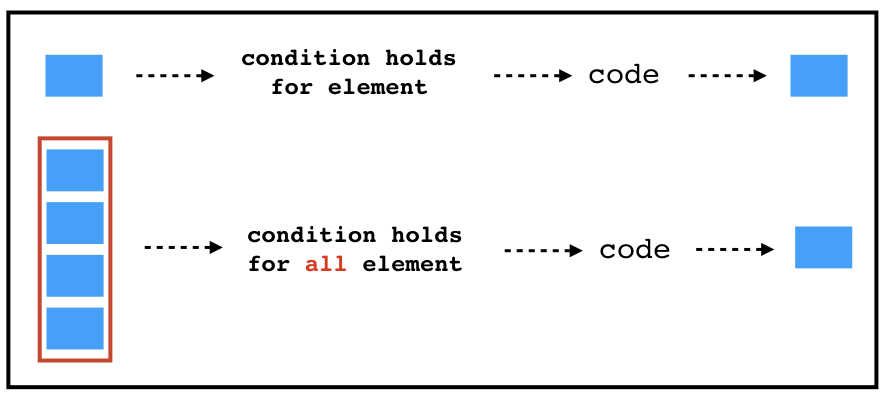
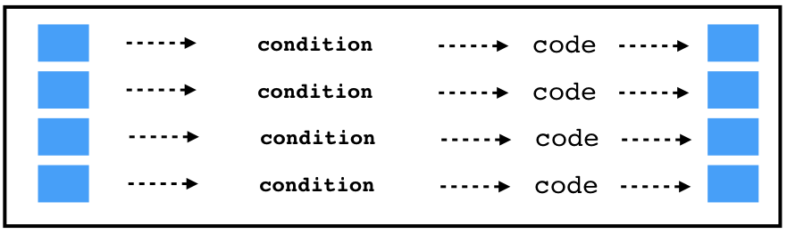
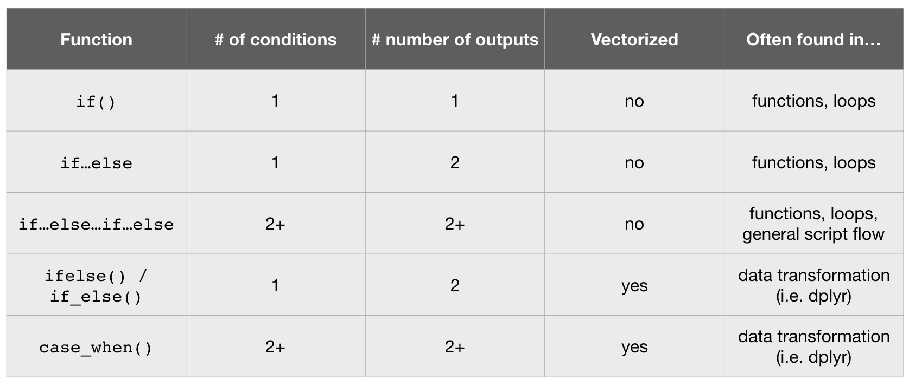

```{r setup, include=FALSE, cache=FALSE}
# set working directory to docs folder
setwd(here::here("docs"))

# Set global R options
options(htmltools.dir.version = FALSE, servr.daemon = TRUE)

# Set global knitr chunk options
knitr::opts_chunk$set(
  fig.align = "center", 
  cache = TRUE,
  error = FALSE,
  message = FALSE, 
  warning = FALSE, 
  collapse = TRUE 
)

# This is good for getting the ggplot background consistent with
# the html background color
library(ggplot2)
thm <- theme_bw()
theme_set(thm)
```

class: clear, center, middle

background-image: url(images/if-statement.png)
background-size: cover

<br><br><br><br><br><br><br><br><br><br><br><br>
.font300.white.bold[`r anicon::nia("Conditional Statements", speed = "slow")`]

---

# Control flow constructs

Often when we're coding we want to control the flow of our actions. Control flow is simply the order in which we code and have our statements evaluated.

1. __Conditional statements__:  things to happen only if a condition or a set of conditions are met

   - single condition, single response: `if()`,
   - multiple conditions, multiple responses: 
      - `if{} else{}` vs. `ifelse()`
      - extending `if{} else{}`
      - `switch()`
      - `case_when()`
   
2. __Repeating operations__: an action to be computed for a particular number of times.

   - perform operation *n* times: `for()`
   - perform operation unlimited times while condition holds: `while() / repeat()`
   - break out of loop or advance to next iteration: `break() / next()`
   
---

# Control flow constructs

Often when we're coding we want to control the flow of our actions. Control flow is simply the order in which we code and have our statements evaluated.

1. __Conditional statements__:  things to happen only if a condition or a set of conditions are met

   - single condition, single response: `if()`,
   - multiple conditions, multiple responses: 
      - `if{} else{}` vs. `ifelse()`
      - extending `if{} else{}`
      - `switch()`
      - `case_when()`
   
2. .opacity20[__Repeating operations__: an action to be computed for a particular number of times.

   - perform operation *n* times: `for()`
   - perform operation unlimited times while condition holds: `while() / repeat()`
   - break out of loop or advance to next iteration: `break() / next()`   
]

.center.bold.blue[This module focuses on conditional statements while later modules will focus on repeating operations.]

---

# `if()`

.font140[We use .blue.bold[`if()`] to execute code when a .blue[single condition] holds.]

.pull-left[


1. evaluates if the test expression is `TRUE`

2. if `TRUE`, execute statement

3. if `FALSE`, do nothing

]

.pull-right[

.code130[
```r
# syntax of if statement
if (test_expression) {
  statement
}
```
]
]

---

# `if()`

.font140[We use .blue.bold[`if()`] to execute code when a .blue[single condition] holds.]

.pull-left[

1. evaluates if the test expression is `TRUE`

2. if `TRUE`, execute statement

3. if `FALSE`, do nothing

Say, for example, that we want R to print a message depending on the value of `x`

]

.pull-right[

.code130[
```r
# syntax of if statement
if (test_expression) {
  statement
}
```
]

.code110[
```{r}
# create x
set.seed(10)
x <- runif(1)
```
]
]

---

# `if()`

.font140[We use .blue.bold[`if()`] to execute code when a .blue[single condition] holds.]

.pull-left[

1. evaluates if the test expression is `TRUE`

2. if `TRUE`, execute statement

3. if `FALSE`, do nothing

Say, for example, that we want R to print a message depending on the value of `x`

<br>

.center.font120[When .font130[`TRUE`]]

]

.pull-right[

.code130[
```r
# syntax of if statement
if (test_expression) {
  statement
}
```
]

.code110[
```{r}
# create x
set.seed(10)
x <- runif(1)
```

```{r}
# check if x meets some condition
if(x > .5) {
  paste("x equals", round(x, 2), "which is greater than 0.5")
}
```
]
]

---

# `if()`

.font140[We use .blue.bold[`if()`] to execute code when a .blue[single condition] holds.]

.pull-left[

1. evaluates if the test expression is `TRUE`

2. if `TRUE`, execute statement

3. if `FALSE`, do nothing

Say, for example, that we want R to print a message depending on the value of `x`

<br>

.center.font120[When .font130[`FALSE`]]

]

.pull-right[

.code130[
```r
# syntax of if statement
if (test_expression) {
  statement
}
```
]

.code110[
```{r}
# create x
set.seed(10)
x <- runif(1)
```

```{r}
# check if x meets some condition
if(x > .7) {
  paste("x equals", round(x, 2), "which is greater than 0.7")
}
```
]
]

---
class: yourturn

# What do you expect to happen?

.font120[Talk with your neighbor(s). What do you expect to happen with this example? `r anicon::cia("images/homer_thinking.png", animate = FALSE, size = 2)`]

.code120[
```{r, results='hide'}
x <- c(8, 3, -2, 5)

if(x < 0) {
  print("x contains a negative number")
}
```
]

--

.pull-left[
.font120[
`r anicon::faa("exclamation-triangle", colour = "red")``r anicon::faa("exclamation-triangle", colour = "red")` Common mistake `r anicon::faa("exclamation-triangle", colour = "red")``r anicon::faa("exclamation-triangle", colour = "red")`

* `if()` is .red[not vectorized]
* `if()` looks for a .red[single logical value]
* this code block evaluated the first element in `x` but not the rest
]
]

.pull-right[
.code120[
```{r, eval=FALSE}
if(x < 0) {
  print("x contains a negative number")
}
## Warning message:
## In if (x < 0) { :
##   the condition has length > 1 and only the first element will be used
```
]
]

---

# Dealing with multiple inputs

.font130[To assess if a condition holds among multiple inputs, use .blue[`any()`] or .blue[`all()`]]

--

.code120[
.pull-left[

.center.font150[`any()`]

```{r using-any()}
any(x < 0)

if(any(x < 0)) {
  print("x contains a negative number")
}
```

]

.pull-right[

.center.font150[`all()`]

```{r using-all()}
all(x < 0)

if(all(x < 0)) {
  print("x contains a negative number")
}
```
]
]

---

# Most common uses of `if()` `r anicon::faa("arrow-right", speed = "slow", colour = "red")` functions & loops

.pull-left[

.center.font130[Functions]

```{r, warning=TRUE, error=TRUE}
mean <- function(x) {
  
  if(!is.numeric(x)) { #<<
    stop("x must be numeric", call. = FALSE) #<<
  } #<<
  
  sum(x) / length(x)
}

mean(letters)
```

```{r remove-mean-function-from-global-environment, echo=FALSE}
rm(echo)
```

]

.pull-right[

.center.font130[Loops]

```{r repeat-until-condition-is-met}
# flip a coin until we get 5 heads in a row
results <- NULL
repeat{
  # flip coin & add to results vector
  results <- c(results, sample(c("heads", "tails"), 1))
  
  # repeat until you have at least 10 flips
  if(length(results) < 10) next() #<<
  
  # if last 10 flips are all the same
  # report number of flips and break
  if(length(unique(tail(results, 10))) == 1) { #<<
    cat("Number of flips:", length(results)) #<<
    break() #<<
  } #<<
}

```

]

.center.bold.blue[We'll see more examples and alternatives of these uses in later modules.]

---

# `if else`

.font110[We can extend an .blue.bold[`if()`] with .blue.bold[`else`] to return two responses based on a single condition.]

.pull-left[


1. evaluates if the test expression is `TRUE`

2. if `TRUE`, execute statement 1

3. if `FALSE`, exectute statement 2

]

.pull-right[

```r
# syntax of if statement
if (test_expression) {
  statement 1
} else {
  statement 2
}
```

]

---

# `if else`

.font110[We can extend an .blue.bold[`if()`] with .blue.bold[`else`] to return two responses based on a single condition.]

.pull-left[


1. evaluates if the test expression is `TRUE`

2. if `TRUE`, execute statement 1

3. if `FALSE`, exectute statement 2

<br>

Now our earlier example will return one result when the test expression returns `TRUE` and another when it returns `FALSE`
]

.pull-right[

```r
# syntax of if statement
if (test_expression) {
  statement 1
} else {
  statement 2
}
```

```{r}
# create x
set.seed(10)
x <- runif(1)
```

```{r}
# check if x meets some condition
if(x > .7) {
  paste("x equals", round(x, 2), "which is greater than 0.7")
} else { #<<
  paste("x equals", round(x, 2), "which is less than 0.7") #<<
} #<<
```

]

---
class: yourturn

# A right way to do things and a wrong way

.font120[Talk with your neighbor(s), which statement is correct and which is not?  Why? `r anicon::cia("images/homer_thinking.png", animate = FALSE, size = 2)`]

.pull-left[

```{r, eval=FALSE}
if(x > .5) {
  TRUE
} else {
  FALSE
}
```


]

.pull-right[

```{r, eval=FALSE}
if(x > .5) {
  TRUE
} 
else {
  FALSE
}
```

]

---
class: yourturn

# A right way to do things and a wrong way

.pull-left[

.center.font200[`r anicon::cia("https://emojis.slackmojis.com/emojis/images/1471987891/1069/thumbs_up.gif?1471987891", animate = FALSE)`]

```{r}
if(x > .5) {
  TRUE
} else { #<<
  FALSE
}
```


]

.pull-right[

.center.font200[`r anicon::cia("https://emojis.slackmojis.com/emojis/images/1471987891/1068/thumbs_down.gif?1471987891", animate = FALSE)`]

```{r, eval=FALSE}
if(x > .5) {
  TRUE
}  #<<
else { #<<
  FALSE
}
## Error: unexpected '}' in "}"
```

]

<br><br>

.center[`r anicon::faa("exclamation-triangle", colour = "red", speed = "slow")` Common mistake: `else` must start on the same line as the closing `}` of the prior `if` statement. `r anicon::faa("exclamation-triangle", colour = "red", speed = "slow")`]

---

# Considering multiple conditions

.font110[We can continue to expand an .blue[`if...else`] statement:]

.code130[
```{r}
if(x < 3) {
  print("x has low tolerance")
} else if(x == 3 & x < 8) {
  print("x has moderate tolerance")
} else {
  print("x has high tolerance")
}
```
]

<br>

.center.bold.font120[Note how we extend by following .font130[`else`] with .font130[`if()`].  But we should always end with an .font130[`else`].]

---
class: yourturn
# Your Turn!

.pull-left[

Fill in the following code chunk so that:

- if month has value .blue[1-9] the file name printed out will be .blue[`"data/month-0X.csv"`]
- if month has value .blue[10-12] the file name printed out will be .blue[`"data/month-1X.csv"`]
- if month is an .blue[invalid month number] (not 1-12), the result printed out is .blue[`"Invalid month"`]
- test it out for when month equals 6, 10, & 13

```r
month <- 4

if(month _____) {
  paste0("data/", "Month-0", month, ".csv")
} else if(month _____) {
  paste0("data/", "Month-", month, ".csv")
} else {
  print("_____")
}
```

]

---
class: yourturn
# Your Turn!

.scrollable90[
.pull-left[

Fill in the following code chunk so that:

- if month has value .blue[1-9] the file name printed out will be .blue[`"data/month-0X.csv"`]
- if month has value .blue[10-12] the file name printed out will be .blue[`"data/month-1X.csv"`]
- if month is an .blue[invalid month number] (not 1-12), the result printed out is .blue[`"Invalid month"`]
- test it out for when month equals 6, 10, & 13

```r
month <- 4

if(month _____) {
  paste0("data/", "Month-0", month, ".csv")
} else if(month _____) {
  paste0("data/", "Month-", month, ".csv")
} else {
  print("_____")
}
```

]

.pull-right[

```{r your-turn-importing-month-file}
month <- 6

if(month %in% 1:9) {
  paste0("data/", "Month-0", month, ".csv")
} else if(month %in% 10:12) {
  paste0("data/", "Month-", month, ".csv")
} else {
  print("Invalid month")
}

month <- 10

if(month %in% 1:9) {
  paste0("data/", "Month-0", month, ".csv")
} else if(month %in% 10:12) {
  paste0("data/", "Month-", month, ".csv")
} else {
  print("Invalid month")
}

month <- 13

if(month %in% 1:9) {
  paste0("data/", "Month-0", month, ".csv")
} else if(month %in% 10:12) {
  paste0("data/", "Month-", month, ".csv")
} else {
  print("Invalid month")
}
```


]
]

---

# Vectorized vs non-vectorized

* So far, we have focused on controlling the flow based on a single conditional statement

```{r non-vectorized-functions, echo=FALSE, out.width="50%"}

```

   
--

* What if we want to assess and execute code if that condition is `TRUE` .blue[across multiple elements (aka vectorized)]?

```{r vectorized-functions, echo=FALSE, out.width="50%"}

```

---

# Vectorized `if...else`

.font120[
We can vectorize an `if...else` statement with:

* `ifelse()`: built in base R version

```{r ifelse-example}
x <- c(runif(5), NA)

ifelse(x > .5, "greater than", "less than")
```

* `dplyr::if_else()`: provides stability in output type and flexibility in what to do with missing values

]

```{r dplyr::ifelse-example}
dplyr::if_else(x > .5, "greater than", "less than", missing = "something else")
```

---

# Vectorizing multiple conditional statements

Best way to vectorize multiple conditions (i.e. `if...else...if...else`]) is with `dplyr::case_when()`

* `x < .3`  .opacity20[`~ "low"`]: condition to assess
* .opacity20[`x < .3`] `~ "low"`: code to execute
* arguments are evaluated in order, so start with most specific to most general

```{r case-when-example}
(x <- c(runif(10), NA, Inf))

dplyr::case_when(
  x < .3   ~ "low",
  x < .7   ~ "medium",
  x <= .10 ~ "high",
  is.na(x) ~ "missing",
  TRUE     ~ "out of bounds"
)
```

---
class: yourturn
# Your Turn!

.pull-left[

### Challenge

Re-write the below code using a .blue[vectorized] approach.  Test the results with `month <- 1:13`.

```r
month <- 1:13

if(month %in% 1:9) {
  paste0("data/", "Month-0", month, ".csv")
} else if(month %in% 10:12) {
  paste0("data/", "Month-", month, ".csv")
} else {
  print("Invalid month")
}
```

]

--

.pull-right[

### Solution

```{r}
month <- 1:13

case_when(
  month >= 1 & month < 10   ~ paste0("data/", "Month-0", month, ".csv"),
  month >= 10 & month <= 12 ~ paste0("data/", "Month-", month, ".csv"),
  TRUE                      ~ "Invalid month"
)
```

]

---

# Conditional statements within dplyr

.scrollable90[
.font120[

* So how can we leverage these skills when performing exploratory data analysis?

* Most common is to use use `ifelse()`, `if_else()`, and `case_when()` within .blue.bold[`dplyr::mutate()`]

]

.pull-left[

```{r}
library(dplyr)

mpg %>%
  select(manufacturer, model, year, cty) %>%
  mutate(cty_rating = if_else(cty > median(cty), "Above", "Below")) #<<
```

]

.pull-right[

```{r}
mpg %>%
  select(manufacturer, model, year, cty) %>%
  mutate(cty_rating = case_when( #<<
    cty < quantile(cty, .33) ~ "Low", #<<
    cty < quantile(cty, .77) ~ "Medium", #<<
    TRUE                     ~ "High" #<<
  )) #<<
```

]
]

---
class: yourturn

# Your Turn!

.pull-left[

Fill in the blanks below to assign each flight to a severity rating of 1, 2, 3, or 4 based on the arrival delay (`arr_delay`) variable:

* `severity = 1`: if `arr_delay` < 25th percentile
* `severity = 2`: if `arr_delay` < 50th percentile
* `severity = 3`: if `arr_delay` < 75th percentile
* `severity = 4`: if `arr_delay` >= 75th percentile

```r
nycflights13::flights %>%
  filter(arr_delay > 0) %>%
  select(carrier, tailnum, arr_delay) %>%
  mutate(severity = case_when(
    ______ ~ 1,
    ______ ~ 2,
    ______ ~ 3,
    ______ ~ 4
  ))
```

.center.bold[Hint: use `quantile(x, perc_value)`]

]

--

.pull-right[

```{r}
nycflights13::flights %>%
  filter(arr_delay > 0) %>%
  select(carrier, tailnum, arr_delay) %>%
  mutate(severity = case_when(
    arr_delay < quantile(arr_delay, .25) ~ 1,
    arr_delay < quantile(arr_delay, .50) ~ 2,
    arr_delay < quantile(arr_delay, .75) ~ 3,
    TRUE                                 ~ 4
  ))
```

]

---
# Summary

<br>

```{r, echo=FALSE}

```


---
# Questions

<br>

```{r questions-control-flow, echo=FALSE, out.height="450", out.width="450"}
knitr::include_graphics("images/questions.png")
```


