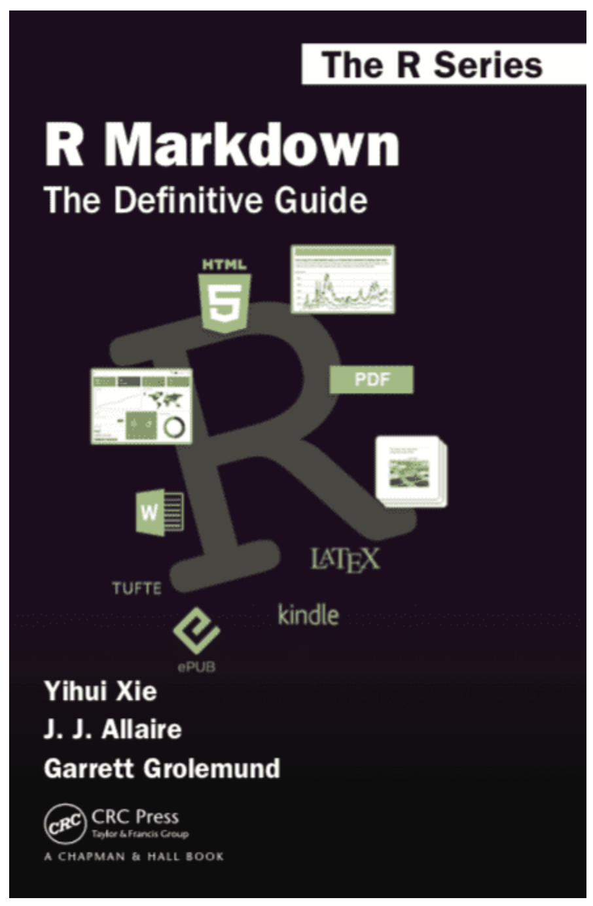
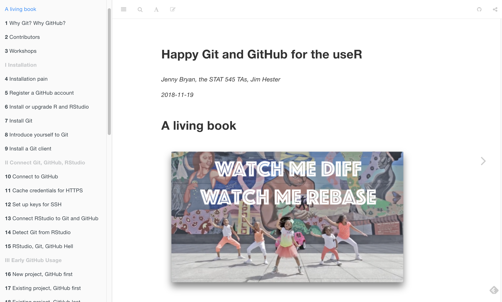

```{r setup, include=FALSE, cache=FALSE}
# set working directory to docs folder
setwd(here::here("docs"))

# Set global R options
options(htmltools.dir.version = FALSE, servr.daemon = TRUE)

# Set global knitr chunk options
knitr::opts_chunk$set(
  fig.align = "center", 
  cache = TRUE,
  error = FALSE,
  message = FALSE, 
  warning = FALSE, 
  collapse = TRUE 
)

# This is good for getting the ggplot background consistent with
# the html background color
library(ggplot2)
thm <- theme_bw()
theme_set(thm)
```

class: clear, center, middle

background-image: url(https://static1.squarespace.com/static/5840371f3e00befa6e8e6739/58e4c75e414fb56455f504a0/58e4c75e414fb56455f5049f/1486220365319/Workflow-logo.png)

---

# Workflow considerations

<br><br>
.font200[

1. Managing your projects

2. Efficient & reproducible deliverables

3. Version control

]

---
class: clear, center, middle
background-image: url(images/working-directories.jpg)
background-size: cover

<br>
.font300.bold.white[Managing Your Projects]

.white[___“Organization is what you do before you do something, so that when you do it, it is not all mixed up.”___ - A.A. Milne]

---

# When first learning R...

.pull-left[

- open R

- start with a .R script

- if we remember, we set the working directory

- `path/to/my/wd/which/only/works/on/my/current/computer`

]

--

.pull-right[

- often results in disorganization

- we find `setwd()` and `rm()` at the top of the script

- image of Jenny Bryan's tweet

]

.center[.content-box-gray[.bold[There is a better way!]]]

---

# R Projects (`.RProj`)

.pull-left[

.font120.bold.center[Creating]

]

--

.pull-right[

.font120.bold.center[Benefits]

]

---

# Referring to subdirectory locations

.pull-left[

.font120.bold.center[Explicit]

]

--

.pull-right[

.font120.bold.center[here Package]

]

---

# Some extra thoughts

.pull-left[

.font120.bold.center[When to use]

]

.pull-right[

.font120.bold.center[When not (required) to use]

- One time analysis, for your own use, and you're 100% sure you will never need to reproduce later on 

- Server setting where workflow is pre-set

- Productionalized scripts

]

---
class: yourturn
# Your Turn!

set up project

---
class: clear, center, middle
background-image: url(images/rmarkdown-image1.png)

<br><br><br>
.font300.bold[Deliverables with R]

___Fully reproducible approach to turn your analyses into high quality documents, reports, presentations and dashboards.___

---

# Typical approach

show workflow of code, results, copy and paste to word doc, write some text, get new results, copy new results, add more or revise text, show to boss, boss says redo with updated monthly sales, ..., get pissed!

.center[.content-box-gray[.bold[There is a better way!]]]

---

# R Markdown

General idea of R Markdown

---

# R Markdown exercise

* Do a detailed exercise to produce an HTML, PDF, and Word report

* Do a shorter exercise to produce slides

---

# Format options

Show a variety of output options

- HTML documents
- PDF documents
- Word documents
- Slides
- Bookdown
- Blogdown

---

# Learn More

.pull-left[

https://bookdown.org/yihui/rmarkdown/

]

.pull-right[

```{r, echo=FALSE, out.width="65%"}

```


]

---
class: clear, center, middle
background-image: url(images/github-mark.png)

.font200.bold[Version Control]

---

# It can be painful but learn it!

.center[
We do not have time to cover version control but you should definitely start by reading this book:

http://happygitwithr.com/
]
```{r, echo=FALSE, out.width="80%"}

```


