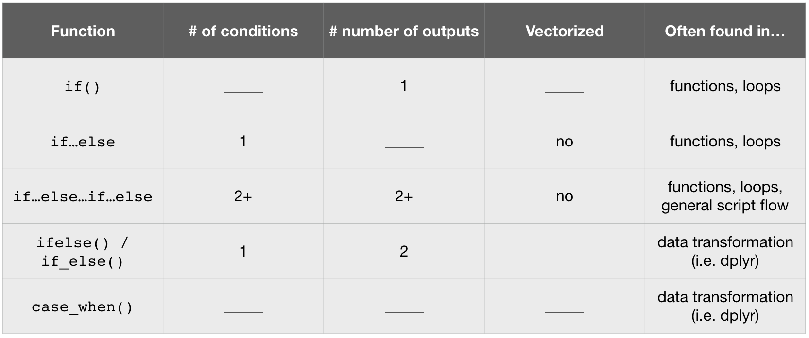

```{r setup, include=FALSE, cache=FALSE}
# Set global R options
options(htmltools.dir.version = FALSE, servr.daemon = TRUE)

# Set global knitr chunk options
knitr::opts_chunk$set(
  fig.align = "center", 
  cache = TRUE,
  error = FALSE,
  message = FALSE, 
  warning = FALSE, 
  collapse = TRUE 
)

# This is good for getting the ggplot background consistent with
# the html background color
library(ggplot2)
thm <- theme_bw()
theme_set(thm)

library(tidyverse)
```

class: title-slide   
<a href="https://github.com/uc-r/Intermediate-R/"></a>


<br><br><br><br>
# Day `r anicon::nia("2", animate = "pulse", speed = "slow", size = 1)`: Intermediate `r anicon::faa("r-project", animate = FALSE, speed = 'slow', color = 'steelblue')`

## .font70[.italic['Success is stumbling from failure to failure with no loss of enthusiasm'] - Winston Churchill]

### Brad Boehmke
### Jan 31 - Feb 1, 2019


---

# Today's schedule `r anicon::faa("calendar-alt", animate = FALSE, colour = "red")`

<br>

| Topic | Time |
|:------|:------:|
| Review | 9:00-9:30 |
| Iteration with loops | 9:30-10:30 |
| Break | 10:30 - 10:45 |
| Iteration with functional programming | 10:45-12:00 |
| Lunch | 12:00 - 1:00 |
| Writing functions | 1:00-2:30 |
| Break | 2:30-2:45 |
| Case study | 2:45-4:00 |
| Q&A | 4:00-4:30 |

---

class: clear, center, middle


background-image: url(images/review-day2.gif)
background-size: cover

---
# Prereqs

```{r}
library(tidyverse)
library(nycflights13)
```


---
# Transforming data

What are the normal __dplyr__ functions to perform the following:

* &lowbar;&lowbar;&lowbar;&lowbar;&lowbar;&lowbar;: pick observations based on certain conditions

* &lowbar;&lowbar;&lowbar;&lowbar;&lowbar;&lowbar;: pick variables of interest

* &lowbar;&lowbar;&lowbar;&lowbar;&lowbar;&lowbar;: compute statistical summaries 

* &lowbar;&lowbar;&lowbar;&lowbar;&lowbar;&lowbar;: perform operations at different levels of your data

* &lowbar;&lowbar;&lowbar;&lowbar;&lowbar;&lowbar;: reorder data

* &lowbar;&lowbar;&lowbar;&lowbar;&lowbar;&lowbar;: create new variables

---

# Transforming data

What are the normal __dplyr__ functions to perform the following:

* .blue.bold[`filter`]: pick observations based on certain conditions

* .blue.bold[`select`]: pick variables of interest

* .blue.bold[`summarize`]: compute statistical summaries 

* .blue.bold[`group_by`]: perform operations at different levels of your data

* .blue.bold[`arrange`]: reorder data

* .blue.bold[`mutate`]: create new variables

---
# Scoped variable transformations

* dplyr scoped variants:
   - &lowbar;&lowbar;&lowbar;&lowbar;&lowbar;&lowbar;: execute function(s) on all variables 
   - &lowbar;&lowbar;&lowbar;&lowbar;&lowbar;&lowbar;: on variables that meet a certain condition
   - &lowbar;&lowbar;&lowbar;&lowbar;&lowbar;&lowbar;: for pre-specified variables

* argument functions within scoped variants:
   - &lowbar;&lowbar;&lowbar;&lowbar;&lowbar;&lowbar;: specify the variables to be executed on
   - &lowbar;&lowbar;&lowbar;&lowbar;&lowbar;&lowbar;: specify the functions to be executed

* helper functions for `filter_*()`
   - &lowbar;&lowbar;&lowbar;&lowbar;&lowbar;&lowbar;: filter for rows where all variables meet the specified condition
   - &lowbar;&lowbar;&lowbar;&lowbar;&lowbar;&lowbar;: filter for rows where at least one variable meets the specified condition

<br>
.center.bold.italic.red.font120[Spend 2 minutes with your neighbor(s) and fill in the blanks.]

---
# Scoped variable transformations

* dplyr scoped variants:
   - .blue.bold[`*_all()`]: execute function(s) on all variables 
   - .blue.bold[`*_if()`]: on variables that meet a certain condition
   - .blue.bold[`*_at()`]: for pre-specified variables

* argument functions within scoped variants:
   - .blue.bold[`vars()`]: specify the variables to be executed on
   - .blue.bold[`funs()`]: specify the functions to be executed

* helper functions for `filter_*()`
   - .blue.bold[`all_vars()`]: filter for rows where all variables meet the specified condition
   - .blue.bold[`any_vars()`]: filter for rows where at least one variable meets the specified condition

---

class: yourturn
# Your Turn!

.pull-left[

### Challenge #1

Use the proper scoped variant of `summarize()` to redo the following more efficiently.

```{r, eval=FALSE}
library(tidyverse)
library(nycflights13)

flights %>%
  group_by(month) %>%
  summarize(
    dep_actual = mean(dep_time, na.rm = TRUE),
    dep_sched  = mean(sched_dep_time, na.rm = TRUE),
    dep_delay  = mean(dep_delay, na.rm = TRUE),
    arr_actual = mean(arr_time, na.rm = TRUE),
    arr_sched  = mean(sched_arr_time, na.rm = TRUE),
    arr_delay  = mean(arr_delay, na.rm = TRUE),
  )
```

]

--

.pull-right[

### Solution

```{r}
flights %>%
  group_by(month) %>%
  summarize_at(vars(matches("dep_|arr_")), mean, na.rm = TRUE)
```

]

---

class: yourturn
# Your Turn!

.pull-left[

### Challenge #2

* Fill in the `mutate_if()` function to standardize the numeric variables.  

* To standardize, use this function `(x - mean(x, na.rm = TRUE)) / sd(x, na.rm = TRUE)`

```{r, eval=FALSE}
flights %>%
  select(carrier, matches("dep_|arr_")) %>%
  mutate_if(
    .predicate = _______, 
    .funs = ________,
    )
```

]

--

.pull-right[

### Solution

```{r}
flights %>%
  select(carrier, matches("dep_|arr_")) %>%
  mutate_if(
    .predicate = is.numeric, 
    .funs = funs((. - mean(., na.rm = TRUE)) / sd(., na.rm = TRUE))
    )
```

]

---

class: yourturn
# Your Turn!

.pull-left[

### Challenge #3

Complete the following to filter out any observation where a "delay" variable contains an `NA`.

```{r, eval=FALSE}
flights %>% 
  filter_at(vars(contains("delay")), _____(!is.na(.)))
```


]

--

.pull-right[

### Solution

```{r}
flights %>% 
  filter_at(vars(contains("delay")), any_vars(!is.na(.)))
```

]

---

# Control statements

.center.bold.italic.red.font120[Spend 2 minutes with your neighbor(s) and fill in the blanks.]

```{r control-statements-quiz, echo=FALSE}

```


---

# Control statements

<br>

```{r control-statements-quiz-results, echo=FALSE}
knitr::include_graphics("images/control-statement-summary.png")
```


---

class: yourturn
# Your Turn!

.pull-left[

### Challenge #1

Fill in the following code chunk so that:

- if month has value .blue[1-9] the file name printed out will be .blue[`"data/month-0X.csv"`]
- if month has value .blue[10-12] the file name printed out will be .blue[`"data/month-1X.csv"`]
- if month is an .blue[invalid month number] (not 1-12), the result printed out is .blue[`"Invalid month"`]
- test it out for when month equals 6, 10, & 13


]

.pull-right[

### Solution

```{r eval=FALSE}
month <- 4 

if(month _____) {
  paste0("data/", "Month-0", month, ".csv")
} _____ if(month _____) {
  paste0("data/", "Month-", month, ".csv")
} else {
  print("_____")
}
```

]

---
class: yourturn
# Your Turn!

.scrollable90[
.pull-left[

### Challenge #1

Fill in the following code chunk so that:

- if month has value .blue[1-9] the file name printed out will be .blue[`"data/month-0X.csv"`]
- if month has value .blue[10-12] the file name printed out will be .blue[`"data/month-1X.csv"`]
- if month is an .blue[invalid month number] (not 1-12), the result printed out is .blue[`"Invalid month"`]
- test it out for when month equals 6, 10, & 13


]

.pull-right[

### Solution

```{r}
month <- 4

if(month %in% 1:9) {
  paste0("data/", "Month-0", month, ".csv")
} else if(month %in% 10:12) {
  paste0("data/", "Month-", month, ".csv")
} else {
  print("Invalid month")
}

month <- 13

if(month %in% 1:9) {
  paste0("data/", "Month-0", month, ".csv")
} else if(month %in% 10:12) {
  paste0("data/", "Month-", month, ".csv")
} else {
  print("Invalid month")
}
```
]
]

---
class: yourturn
# Your Turn!

.pull-left[

### Challenge #2

Use `ifelse()` or `if_else()` to print .bold[_"greater than or equal"_] or .bold[_"less than"_] for each element of `x`.  Use 0.5 as the threshold.

```{r}
x <- runif(10)
```


]

--

.pull-right[

### Solution

```{r}
ifelse(x >= .5, "greather than or equal to", "less than")
```

]

---

class: yourturn
# Your Turn!

.pull-left[

Fill in the blanks below to assign each flight to a severity rating of 1, 2, 3, or 4 based on the arrival delay (`arr_delay`) variable:

* `severity = 1`: if `arr_delay` < 25th percentile
* `severity = 2`: if `arr_delay` < 50th percentile
* `severity = 3`: if `arr_delay` < 75th percentile
* `severity = 4`: if `arr_delay` >= 75th percentile

```r
flights %>%
  filter(arr_delay > 0) %>%
  select(carrier, tailnum, arr_delay) %>%
  mutate(severity = case_when(
    ______ ~ 1,
    ______ ~ 2,
    ______ ~ 3,
    ______ ~ 4
  ))
```

.center.bold[Hint: use `quantile(x, perc_value)`]

]

--

.pull-right[

```{r}
flights %>%
  filter(arr_delay > 0) %>%
  select(carrier, tailnum, arr_delay) %>%
  mutate(severity = case_when(
    arr_delay < quantile(arr_delay, .25) ~ 1,
    arr_delay < quantile(arr_delay, .50) ~ 2,
    arr_delay < quantile(arr_delay, .75) ~ 3,
    TRUE                                 ~ 4
  ))
```

]


---
# Workflow

<br>

.font120[
1. &lowbar;&lowbar;&lowbar;&lowbar;&lowbar;&lowbar;: Organizes each data analysis into its own project? 

2. &lowbar;&lowbar;&lowbar;&lowbar;&lowbar;&lowbar;: Combines text and code to create efficient and reproducible analytic deliverables (i.e. reports, presentations)
]

---
# Workflow

<br>

.font120[
1. .bold.blue[R Projects]: Organizes each data analysis into its own project? 

2. .bold.blue[R Markdown]: Combines text and code to create efficient and reproducible analytic deliverables (i.e. reports, presentations)
]

---

# Questions before `r anicon::nia("moving on?", animate = "passing", speed = "slow")`

<br>

```{r questions-ggplot, echo=FALSE, out.height="450", out.width="450"}
knitr::include_graphics("images/questions.png")
```
