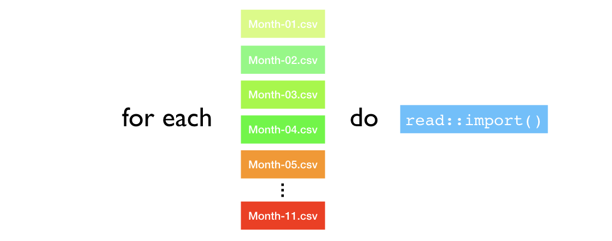
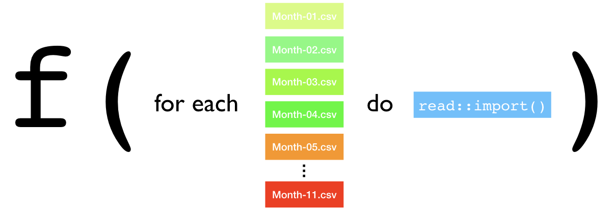
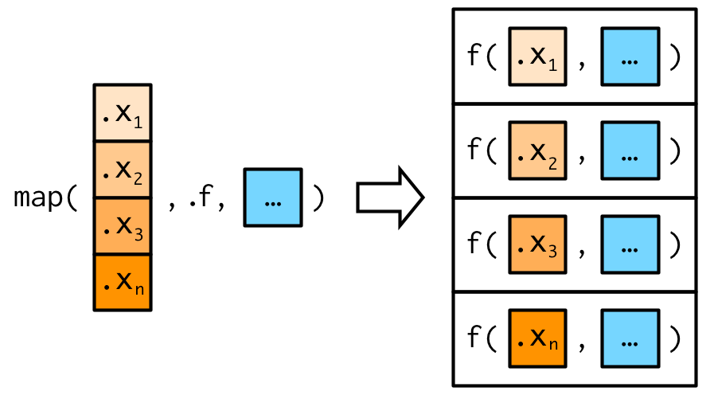
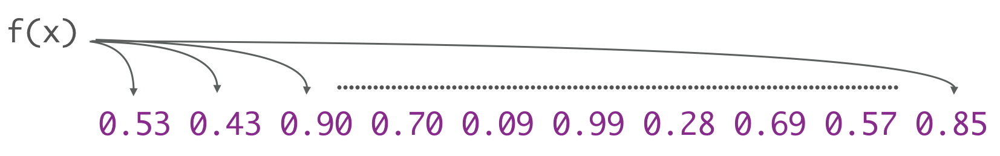
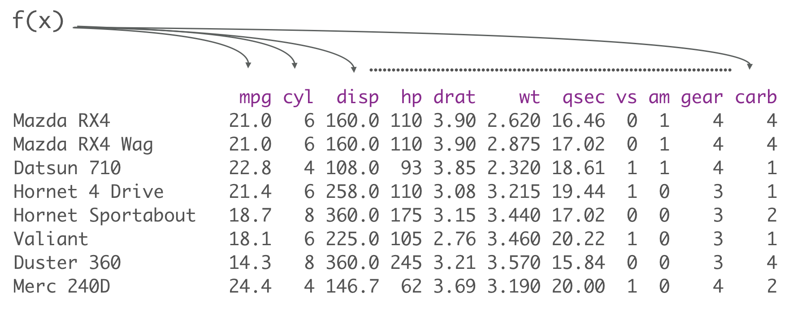
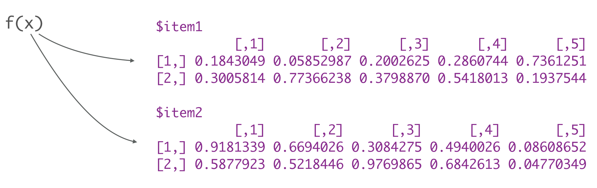

```{r setup, include=FALSE, cache=FALSE}
# Set global R options
options(htmltools.dir.version = FALSE, servr.daemon = TRUE)

# Set global knitr chunk options
knitr::opts_chunk$set(
  fig.align = "center", 
  cache = TRUE,
  error = FALSE,
  message = FALSE, 
  warning = FALSE, 
  collapse = TRUE 
)

# set ggplot theme in case I do any plotting
library(ggplot2)
thm <- theme_bw()
theme_set(thm)
```

class: clear, center, middle

background-image: url("images/iterate-icon.jpg")
background-size: contain

<br><br><br><br><br><br><br><br><br><br><br><br><br><br>
.center.font200[with functional programming]

---
class: clear, center, middle

background-image: url("https://www.corporatecomplianceinsights.com/wp-content/uploads/2017/06/thinking-man.jpg")
background-size: cover


<br><br><br><br><br><br><br><br><br><br><br><br><br>
.center.font200.bold.white[A mental model]

---
# Functional Programming

.pull-left[
<br>
.font150.center[

Iteration can be summed up as:

FOR EACH <u>&nbsp;&nbsp;&nbsp;&nbsp;&nbsp;</u> DO <u>&nbsp;&nbsp;&nbsp;&nbsp;&nbsp;</u>

]

]

--

.pull-right[

.center[You've probably done something like this with .bold.blue[copy & paste]]

```{r eval=FALSE}
df1 <- readr::read_csv("data/Month-01.csv")
df2 <- readr::read_csv("data/Month-02.csv")
df3 <- readr::read_csv("data/Month-02.csv")
df4 <- readr::read_csv("data/Month-03.csv")
df5 <- readr::read_csv("data/Month-04.csv")
...
df11 <- readr::read_csv("data/Month-11.csv")
```

<br>
.center.bold[.content-box-gray[error prone, inefficient & eyes drawn to 
what's the same rather than what's different]]

]

---
# Functional Programming

.pull-left[
<br>
.font150.center[

Iteration can be summed up as:

FOR EACH <u>&nbsp;&nbsp;&nbsp;&nbsp;&nbsp;</u> DO <u>&nbsp;&nbsp;&nbsp;&nbsp;&nbsp;</u>

]

]

.pull-right[

.center[You've probably done something like this with .bold.blue[.font120[`for`] loops]]

```{r eval=FALSE}
for(i in list.files("data")) {
  # steps to import each data set
  df <- readr::read_csv(paste0("data/", i))
  new_name <- stringr::str_sub(i, end = -5)
  assign(new_name, df)
  rm(df)
}
```

<br><br>
.center.bold[.content-box-gray[tough to focus on the intent]]

]

---
# Functional Programming

The intent of these approaches is 


```{r echo=FALSE, out.width="90%", out.height="90%"}

```


---
# Functional Programming

Functional programming turns this idea into a function:

```{r echo=FALSE, out.width="90%", out.height="90%"}

```

<br>

.center[.content-box-gray[which is more .bold.blue[efficient], .bold.blue[strict], and .bold.blue[explicit]!  .red.bold[But how?]]]

---
class: clear, center, middle

```{r echo=FALSE, out.width="50%", out.height="50%"}
knitr::include_graphics("https://media.mnn.com/assets/images/2013/05/grumpyCatComplain.jpg.838x0_q80.jpg")
```

<br>
.center.font200.bold[Application]
.center.font150[_What the hell does a cat have to do with this?_]

---
# Introducing the purrr package

.pull-left[

.font120[
The __purr__ package provides functional programming tools that:

1. for each element of x

2. apply function f and

3. provide consistent output

]
]

.pull-right[

```{r echo=FALSE, out.width="60%", out.height="60%"}
knitr::include_graphics("https://github.com/rstudio/hex-stickers/blob/master/PNG/purrr.png?raw=true")
```

]

<br>

.center[.content-box-gray[Disclaimer: __purrr__ is part of the tidyverse: https://purrr.tidyverse.org/]]

---
# Prerequisites

.pull-left[

### Package requirements

```{r message=TRUE, warning=TRUE}
library(tidyverse)    # includes purrr and other pkgs we'll use
library(repurrrsive)  # provides different data sets
```

]

--

.pull-right[
First introductions to __purrr__ typically revolve around the family of .font120.bold.red[`map()`] functions:

```{r}
lsf.str("package:purrr", pattern = "^map")
```

]

---
# Basics of the .font120.red[`map()`] functions

.pull-left[

<br>
.center[.content-box-gray[.font200[`map( .x, .f, ...)`]

.font150[for each element of <u>.x</u> do <u>.f</u>]
]]


* .font120.bold[`.x`]: input (vector, data frame, or list)

* .font120.bold[`.f`]: function to apply

* .font120.bold[`...`]: addtl parameters

]

.pull-right[

<br>

```{r, echo=FALSE}

```

]

---
# The .red[inputs]

.pull-left[

<br>
.center[.content-box-gray[.font200[.opacity20[`map( `]`.x`.opacity20[`, .f, ...)`]]

.font150[for each element of <u>.x</u> do <u>.f</u>]
]]

.font120[
* .font120.bold[`.x`]: input (<u>vector</u>, data frame, or list)
]

]

.pull-right[

When our input is a .red.bold[vector]

```{r eval=FALSE}
map(vector, function)
```

```{r echo=FALSE}

```

]

---
# The .red[inputs]

.pull-left[

<br>
.center[.content-box-gray[.font200[.opacity20[`map( `]`.x`.opacity20[`, .f, ...)`]]

.font150[for each element of <u>.x</u> do <u>.f</u>]
]]

.font120[
* .font120.bold[`.x`]: input (vector, <u>data frame</u>, or list)
]

]

.pull-right[

When our input is a .red.bold[data frame]

```{r eval=FALSE}
map(vector, function)
```

```{r echo=FALSE}

```

]

---
# The .red[inputs]

.pull-left[

<br>
.center[.content-box-gray[.font200[.opacity20[`map( `]`.x`.opacity20[`, .f, ...)`]]

.font150[for each element of <u>.x</u> do <u>.f</u>]
]]

.font120[
* .font120.bold[`.x`]: input (vector, data frame, or <u>list</u>)
]

]

.pull-right[

When our input is a .red.bold[list]

```{r eval=FALSE}
map(vector, function)
```

```{r echo=FALSE}

```

]

---
class: yourturn
# Give me some examples!

.pull-left[

Run the following examples in your console.  Don't worry about understanding everything, but identify

1. what is the input of each map function,

2. what is the output of each map function, and

3. talk to your neighbor about what you think each function is doing.

<br>

.center[.content-box-gray[Note how .font120[`purrr::map()`] is .font120[`%>%`] friendly.]]

]

.pull-right[

```{r, eval=FALSE}
# 1.
iris %>% map(n_distinct)

# 2.
input <- c(1, 5, 10)
input %>% map(runif, min = 1, max = 2)

# 3.
input %>% map(~ sample(1:10, size = .x, replace = TRUE))
```

]

---
class: yourturn
# Give me some examples!

.pull-left[

1. inputs:
   1. data frame
   2. vector
   3. list

2. outputs: by default `map()` consistently returns a list (we'll come back to this shortly)
   
3. functions applied: 
   1. `n_distinct(.x)`
   2. `runif(.x, min = 1, max = 2)`
   3. `sample(1:10, size = .x, replace = TRUE)`
   

.center[___Note the different ways we can call a function!___]


]

.pull-right[

```{r, eval=FALSE}
# 1.
iris %>% map(n_distinct)

# 2.
input <- c(1, 5, 10)
input %>% map(runif, min = 1, max = 2)

# 3.
input %>% map(~ sample(1:10, size = .x, replace = TRUE))
```

]

---
# The .red[function call]

.pull-left[

<br>
.center[.content-box-gray[.font200[.opacity20[`map( .x, `]`.f, ...`.opacity20[`)`]]

.font150[for each element of <u>.x</u> do <u>.f</u>]
]]

* .opacity20[.font120.bold[`.x`]: input (vector, data frame, or list)]

* .font120.bold[`.f`]: function to apply

* .font120.bold[`...`]: addtl parameters

]

.pull-right[

<br>

We can make function calls in different ways:

```{r eval=FALSE}
# function with default parameters, by default
# .x will go in as the first argument
map(input, runif)
```

]

---
# The .red[function call]

.pull-left[

<br>
.center[.content-box-gray[.font200[.opacity20[`map( .x, `]`.f, ...`.opacity20[`)`]]

.font150[for each element of <u>.x</u> do <u>.f</u>]
]]

* .opacity20[.font120.bold[`.x`]: input (vector, data frame, or list)]

* .font120.bold[`.f`]: function to apply

* .font120.bold[`...`]: addtl parameters

]

.pull-right[

<br>

We can make function calls in different ways:

```{r eval=FALSE}
# function with default parameters, by default
# .x will go in as the first argument
map(input, runif)

# same as above but supplying additional parameters
map(input, runif, min = 1, max = 2)
```

]

---
# The .red[function call]

.pull-left[

<br>
.center[.content-box-gray[.font200[.opacity20[`map( .x, `]`.f, ...`.opacity20[`)`]]

.font150[for each element of <u>.x</u> do <u>.f</u>]
]]

* .opacity20[.font120.bold[`.x`]: input (vector, data frame, or list)]

* .font120.bold[`.f`]: function to apply

* .font120.bold[`...`]: addtl parameters

]

.pull-right[

<br>

We can make function calls in different ways:

```{r eval=FALSE}
# function with default parameters, by default
# .x will go in as the first argument
map(input, runif)

# same as above but supplying additional parameters
map(input, runif, min = 1, max = 2)

# anonymous function defined using formula shortcut
# handy when .x is not first argument
map(input, ~ sample(1:10, size = .x, replace = TRUE))
```

]

---
# The .red[function call]

.pull-left[

<br>
.center[.content-box-gray[.font200[.opacity20[`map( .x, `]`.f, ...`.opacity20[`)`]]

.font150[for each element of <u>.x</u> do <u>.f</u>]
]]

* .opacity20[.font120.bold[`.x`]: input (vector, data frame, or list)]

* .font120.bold[`.f`]: function to apply

* .font120.bold[`...`]: addtl parameters

]

.pull-right[

<br>

We can make function calls in different ways:

```{r eval=FALSE}
# function with default parameters, by default
# .x will go in as the first argument
map(input, runif)

# same as above but supplying additional parameters
map(input, runif, min = 1, max = 2)

# anonymous function defined using formula shortcut
# handy when .x is not first argument
map(input, ~ sample(1:10, size = .x, replace = TRUE))

# traditional approach to apply anonymous function
# TOO VERBOSE! #<< 
map(input, function(x) sample(1:10, size = .x, replace = TRUE))
```

]

---
class: yourturn
# Your Turn!

.pull-left[

Remember how `list.files("data")` shows all the .csv files?  See if you can:

1. combine `list.files("data")` and `paste0("data/", ...)` to create the following inputs:
    ```{r, echo=FALSE}
    list.files("data") %>% paste0("data/", .)
    ```
2. now use this input vector, `map()`, and `read_csv()` to import all the data files into a list
  

]

---
class: yourturn
# Your Turn!

.scrollable90[
.pull-left[

Remember how `list.files("data")` shows all the .csv files?  See if you can:

1. combine `list.files("data")` and `paste0("data/", ...)` to create the following inputs:
    ```{r, echo=FALSE}
    list.files("data") %>% paste0("data/", .)
    ```
2. now use this input vector, `map()`, and `read_csv()` to import all the data files into a list
   
]

.pull-right[

```{r}
list.files("data") %>% 
  paste0("data/", .) %>%
  map(read_csv)
```

]
]

---
# Different .font120.red[`map()`] functions for different .red[outputs]

<br>
* As previously mentioned, .font120[`map()`] returns a list, which makes it the most general of the “map” family because you can put anything in a list.

* It is ___inconvenient___ to return a list when a simpler data structure would do

* Alternative .font120[`map()`] variants include:

   - .font120[`map_dbl()`] returns a double vector 
   - .font120[`map_lgl()`] returns a logical vector 
   - .font120[`map_int()`] returns a integer vector 
   - .font120[`map_chr()`] returns a character vector
   - .font120[`map_df()`] returns a data frame

---
# A family of .font120.red[`map()`] functions

.scrollable90[
.pull-left[

* Its best to use the most restrictive function for the output

* Informative errors will let you know when a problem arises with your output

* You can always use `map()` to help debug the output error

]

.pull-right[
```{r}
# output is double
mtcars %>% map_dbl(sd)

# output is integer
iris %>% map_int(n_distinct)

# output is logical
iris %>% map_lgl(is.numeric)

# output is character
iris %>% map_chr(is.character)

# output is data frame
mtcars %>% map_df(scale)
```
]
]

---
class: yourturn
# Your Turn!

.pull-left[
With the built-in `airquality` data set, use the most appropriate map functions to answer these three questions:

1. how many `n_distinct` values are in each column?

2. are there any missing values in this data set?

3. what is the standard deviation for each variable?

]

--

.pull-right[

```{r}
# 1
airquality %>% map_int(n_distinct)

# 2 
airquality %>% map_lgl(~ any(is.na(.x)))

# 3
airquality %>% map_dbl(sd, na.rm = TRUE)
```

]

---
# .red[ROAD].gray[`map()`]

You've been introduced to the main components of __purrr__ functional programming:

1. how functions work with different inputs (`.x`: vectors, data frames, lists)

2. how you can call functions (`.f`: name only, name + additional args, anonymous function)

3. how you can pre-specify your output

--

So, right now you probably fall in one of two camps:

--

.pull-left[

.center.bold[Experienced .font120[`for`] loop user]

Switching to functionals is typically a pattern matching exercise. You look at the for loop and find a functional that matches the basic form.

]

--

.pull-right[

.center.bold[New to iteration]

.center[
`r anicon::cia("https://emojis.slackmojis.com/emojis/images/1466642830/552/wtf.gif?1466642830", animate = FALSE, size = 3)`
]
]

--

.center.red[
___Don't worry, the following 3 steps will provide you with a strategy to simplify___ 
]

---
# .red[ROAD].gray[`map()`]

<br>

.font150.bold.blue[
Strategy
]

.font130[
1. Do it for one element

2. Turn it into a recipe

3. Use `map_*()` to do it to all elements
]

---
# How many films has each character been in?

.pull-left[

* the .font120[`sw_people`] data set contains all the characters from the Star Wars chronicles

* What if we want to find how many .font120[`$films`] each character has been in?
]

.pull-right[

```{r}
glimpse(sw_people)
```


]

---
# .red[\#1 Do it for one element]

```{r}
# do it for the first element
x1 <- sw_people[[1]]
length(x1$films)
```

---
# .red[\#1 Do it for one element]

```{r}
# do it for the first element
x1 <- sw_people[[1]]
length(x1$films)

# do it for the second element
x2 <- sw_people[[2]]
length(x2$films)
```

---
# .red[\#1 Do it for one element]

```{r}
# do it for the first element
x1 <- sw_people[[1]]
length(x1$films)

# do it for the second element
x2 <- sw_people[[2]]
length(x2$films)

# do it for the third element
x3 <- sw_people[[3]]
length(x3$films)
```

---
# .red[\#1 Do it for one element]

.pull-left[

.center[Common function theme: <br>.font120[`length(`]<u>&nbsp;&nbsp;&nbsp;&nbsp;&nbsp;</u>.font120[`$films)`]]

```{r}
# do it for the first element
x1 <- sw_people[[1]]
length(x1$films) #<<

# do it for the second element
x2 <- sw_people[[2]]
length(x2$films) #<<

# do it for the third element
x3 <- sw_people[[3]]
length(x3$films) #<<
```

]

--

.pull-right[

.center[Common output theme: <br>Integers]

```{r eval=FALSE}
# do it for the first element
x1 <- sw_people[[1]]
length(x1$films)
## [1] 5 #<<

# do it for the second element
x2 <- sw_people[[2]]
length(x2$films)
## [1] 6 #<<

# do it for the third element
x3 <- sw_people[[3]]
length(x3$films)
## [1] 7 #<<
```

]

---
# .red[\#2 Turn it into a recipe]

.pull-left[

.center[
Common function theme: <br>.font120[`length(`]<u>&nbsp;&nbsp;&nbsp;&nbsp;&nbsp;</u>.font120[`$films)`]

<br>

Resulting recipe:

.font120[.blue[`~`]` length(`.red[`.x`]`$films)`]

]

<br>
* .font120.blue[`~`]: anonymous function shortcut
* .font120.red[`.x`]: one element of our vector

]

---
# .red[\#3 Do it for all elements]

.pull-left[

.center[
Common function theme: <br>.font120[`length(`]<u>&nbsp;&nbsp;&nbsp;&nbsp;&nbsp;</u>.font120[`$films)`]

<br>

Resulting recipe:

.font120[.blue[`~`]` length(`.red[`.x`]`$films)`]

]

<br>
* .font120.blue[`~`]: anonymous function shortcut
* .font120.red[`.x`]: one element of our vector

]

.pull-right[

.center[Common output theme: <br>Integers: use .font120[`map_int()`]]

```{r}
sw_people %>% map_int(~ length(.x$films))
```

]

---
class: yourturn
# Your Turn!

.pull-left[
Use the:

1. do it for one,
2. create recipe,
3. do it for all

strategy to:

1. Extract the name of each character
2. Identify if the character is male
3. Identify the proportion of characters that are male
]

---
class: yourturn
# Your Turn!

.pull-left[
Use the:

1. do it for one,
2. create recipe,
3. do it for all

strategy to:

1. Extract the name of each character
2. Identify if the character is male
3. Identify the proportion of characters that are male
]

.pull-right[

```{r}
# 1. Extract the name of each character
sw_people %>% map_chr(~ .x$name)
```


]

---
class: yourturn
# Your Turn!

.pull-left[
Use the:

1. do it for one,
2. create recipe,
3. do it for all

strategy to:

1. Extract the name of each character
2. Identify if the character is male
3. Identify the proportion of characters that are male
]

.pull-right[

```{r}
# 2. Identify if the character is male
sw_people %>% map_lgl(~ .x$gender == "male")
```

]

---
class: yourturn
# Your Turn!

.pull-left[
Use the:

1. do it for one,
2. create recipe,
3. do it for all

strategy to:

1. Extract the name of each character
2. Identify if the character is male
3. Identify the proportion of characters that are male
]

.pull-right[

```{r}
# 3. Identify the proportion of characters that are male
sw_people %>% 
  map_lgl(~ .x$gender == "male") %>%
  mean()
```

]

---
class: clear, center, middle

```{r echo=FALSE, out.width="50%", out.height="50%"}
knitr::include_graphics("http://sanitarian.net/wp-content/uploads/2011/02/appetiters1.jpg")
```

.center.font150.bold[Some advanced features to whet your appetite for more!]

---
# Names are useful!

.pull-left[
.blue[Pro tip]: __purrr__ has a .font120[`set_names()`] function that makes renaming elements easy

]

.pull-right[

```{r}
sw_people %>% 
  map_chr(~ .x$name) %>%          # get names of each character
  set_names(sw_people, .) %>%     # set list names #<<
  map_int(~ length(.x$films)) %>% # get number of films
  sort(decreasing = TRUE) 
```

]

---
# Combining multiple functionals is powerful

Say we wanted to compare the approval/disapproval ratio for .font120[`Transaction_Status`] across all our .font120[`Month-XX.csv`] files.

--

.pull-left[

.center[We can accomplish this with a sequence of functionals as follows:]


```{r}
list.files("data") %>% 
  paste0("data/", .) %>%
  map(read_csv) %>%
  set_names(., nm = list.files("data")) %>%
  map(~ .x$Transaction_Status == "Approved") %>%
  map_dbl(mean)
```

]

--

.pull-right[

.center[Or with some initial functionals followed by __dplyr__]

```{r}
list.files("data") %>% 
  paste0("data/", .) %>%
  map_dfr(read_csv) %>%  # row bind list to data frame #<<
  group_by(Month) %>%
  summarize(Approval_ration = mean(Transaction_Status == "Approved"))
```

]

---
# .font120.red[`map2()`] for two input elements

Say we have a procedure based on two inputs.  For example, we want to make predictions for 10 countries with their respective linear models.

.pull-left[
```{r}
# input 1: data
glimpse(gap_split_small)
```
]

.pull-right[
```{r}
# input 2: models
(gap_mods <- gap_split_small %>%
  map(~ lm(
    formula = lifeExp ~ year + pop + gdpPercap,
    data = .x
    ))
)
```

]

---
# .font120.red[`map2()`] for two input elements

Say we have a procedure based on two inputs.  For example, we want to make predictions for 10 countries with their respective linear models.

```{r}
# 1. do for one
predict(gap_mods[[1]], gap_split_small[[1]])
```

--

```{r eval=FALSE}
# 2. identify recipe
predict(________, ________)
```

--

```{r}
# 3. do for all
map2(gap_mods, gap_split_small, predict) %>% glimpse(give.attr = FALSE)
```

]

---
# .font120.red[`pmap()`] for n input elements

.pull-left[

And if we have a procedure with $>2$ elements:

Say we want to iterate over each of the following hyperparameters for a random forest model:

```{r}
# list of hyper parameter inputs
hyper_params <- list(
  mtry = c(20, 25, 30),
  node_size = c(3, 6, 9),
  sample_size = c(.50, .632, .80)
)
```

]

---
# .font120.red[`pmap()`] for n input elements

.scrollable90[
.pull-left[

And if we have a procedure with $>2$ elements:

Say we want to iterate over each of the following hyperparameters for a random forest model:

```{r}
# 27 combinations of hyper parameter inputs
(hyper_params <- expand.grid(
  mtry = c(20, 25, 30),
  node_size = c(3, 6, 9),
  sample_size = c(.50, .632, .80)
))
```

]

.pull-right[

```{r}
# 1. do it for one
ranger::ranger(
  formula         = Sale_Price ~ ., 
  data            = AmesHousing::make_ames(), 
  num.trees       = 500,
  mtry            = hyper_params$mtry[1],
  min.node.size   = hyper_params$node_size[1],
  sample.fraction = hyper_params$sample_size[1],
  seed            = 123
  )$prediction.error
```

```{r, eval=FALSE}
# 2. identify recipe
ranger::ranger(
  formula         = Sale_Price ~ ., 
  data            = AmesHousing::make_ames(), 
  num.trees       = 500,
  mtry            = ________,
  min.node.size   = ________,
  sample.fraction = ________,
  seed            = 123
  )$prediction.error
```

```{r pmap-example}
# 3. do it for all
pmap_dbl(
  hyper_params, 
  ~ ranger::ranger(
    formula         = Sale_Price ~ ., 
    data            = AmesHousing::make_ames(), 
    num.trees       = 500,
    mtry            = ..1,
    min.node.size   = ..2,
    sample.fraction = ..3,
    seed            = 123
    )$prediction.error
  )
```
]
]

---
# So much more!

And there is so much more in the ___purrr___ package!

.scrollable90[
```{r}
lsf.str("package:purrr")
```
]

---
# But there are base R functionals?

Yes, there are base R functionals (i.e. .font120[`sapply()`], .font120[`lapply()`], .font120[`vapply()`])

But...

.red[
- inconsistencies in output.  What does .font120[`sapply()`] return?  It depends.
- inconsistencies in syntax.
- supplying anonymous functions and additional arguments gets verbose.
- limited on functional capabilities
]

--

Motivation for __purrr__:

.green[
- consistent return type,
- consistent syntax,
- useful function call shortcuts,
- provides more complicated functionals
]

---
# Summary

.font120[
__functional programming with purrr provides__

- functions that write loops for you

- consistent syntax

- convenient shortcuts
]

--

.font120[
__Choosing the right function depends on:__

- type of iteration

- elements under consideration

- type of output

]

---
# Learning More

.pull-left[

.center.font120[Yes, functional programming is difficult to grasp!]

```{r echo=FALSE}
knitr::include_graphics("https://media1.tenor.com/images/98106050cdaa3e90bfd9cb210d9453e9/tenor.gif?itemid=5202885")
```

]

--

.pull-right[

* R for Data Science [`r anicon::faa("external-link-alt", animate = FALSE)`](https://r4ds.had.co.nz/iteration.html)

* Advanced R [`r anicon::faa("external-link-alt", animate = FALSE)`](https://adv-r.hadley.nz/functionals.html#base-functionals)

* Jenny Bryan's __purrr__ tutorials [`r anicon::faa("external-link-alt", animate = FALSE)`](https://jennybc.github.io/purrr-tutorial/)

* Foundations of Functional Programming with purrr [`r anicon::faa("external-link-alt", animate = FALSE)`](https://www.datacamp.com/courses/foundations-of-functional-programming-with-purrr)

* Intermediate Functional Programming with __purrr__ [`r anicon::faa("external-link-alt", animate = FALSE)`](https://www.datacamp.com/courses/intermediate-functional-programming-with-purrr)

]

---
# Questions

<br>

```{r questions-fp, echo=FALSE, out.height="450", out.width="450"}
knitr::include_graphics("images/questions.png")
```

