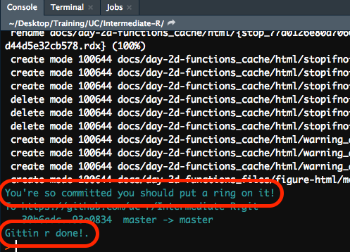
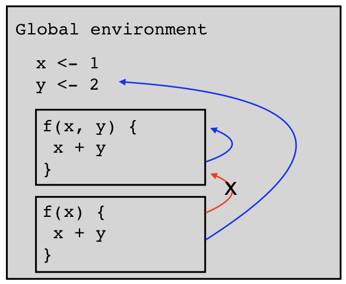
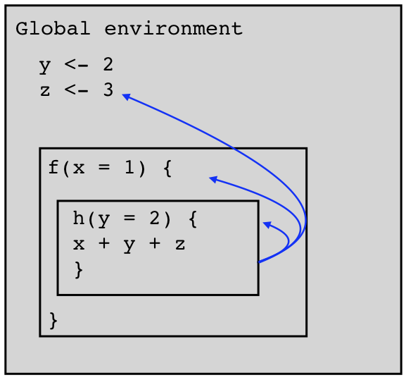

```{r setup, include=FALSE, cache=FALSE}
# Set global R options
options(htmltools.dir.version = FALSE, servr.daemon = TRUE)

# Set global knitr chunk options
knitr::opts_chunk$set(
  fig.align = "center", 
  cache = TRUE,
  error = FALSE,
  message = FALSE, 
  warning = FALSE, 
  collapse = TRUE 
)

# set ggplot theme in case I do any plotting
library(ggplot2)
thm <- theme_bw()
theme_set(thm)
```

class: clear, center, middle

background-image: url("images/function-icon.jpg")
background-size: contain

<br><br><br><br><br><br><br><br><br><br><br><br><br>
.center.font300.bold[Writing Functions]
.center[_"Writing good functions is a lifetime journey."_ - Hadley Wickham]

---
# Overview

- Why functions are good

- Anatomy of a function

- Defining functions

- Defining your arguments

- Checking arguments and other conditions

- Lazy evaluation

- Lexical scoping

- Distributing your function(s)

- Learning more

---
# Why functions are good

.pull-left[
* A function centralizes a common task to a single, abstract method

* This helps to:

   - increase .green[reusability] which...
   - reduces .red[verbosity]
   - reduces .red[repetitiveness]
   - reduces the .red[chance of making an error]
   - reduces .red[instances requiring updates] when changes are needed
   - reduces .red[amount of code to test]
]

--

.pull-right[

Consider the following from Hadley Wickham’s book _R for Data Science_.  Where's the .red[error]?

```{r, eval=FALSE}
df <- tibble::tibble(
  a = rnorm(10),
  b = rnorm(10),
  c = rnorm(10),
  d = rnorm(10)
)

df$a <- (df$a - min(df$a, na.rm = TRUE)) /
  (max(df$a, na.rm = TRUE) - min(df$a, na.rm = TRUE))
df$b <- (df$b - min(df$b, na.rm = TRUE)) /
  (max(df$b, na.rm = TRUE) - min(df$b, na.rm = TRUE))
df$c <- (df$c - min(df$c, na.rm = TRUE)) /
  (max(df$c, na.rm = TRUE) - min(df$c, na.rm = TRUE))
df$d <- (df$d - min(df$d, na.rm = TRUE)) /
  (max(df$d, na.rm = TRUE) - min(df$d, na.rm = TRUE))
```

]

---
# Why functions are good

.pull-left[
* A function centralizes a common task to a single, abstract method

* This helps to:

   - increase .green[reusability] which...
   - reduces .red[verbosity]
   - reduces .red[repetitiveness]
   - reduces the .red[chance of making an error]
   - reduces .red[instances requiring updates] when changes are needed
   - reduces .red[amount of code to test]
]

.pull-right[

Consider the following from Hadley Wickham’s book _R for Data Science_.  Where's the .red[error]?

```{r, eval=FALSE}
df <- tibble::tibble(
  a = rnorm(10),
  b = rnorm(10),
  c = rnorm(10),
  d = rnorm(10)
)

df$a <- (df$a - min(df$a, na.rm = TRUE)) / 
  (max(df$a, na.rm = TRUE) - min(df$a, na.rm = TRUE))
df$b <- (df$b - min(df$b, na.rm = TRUE)) / 
  (max(df$b, na.rm = TRUE) - min(df$a, na.rm = TRUE)) #<<
df$c <- (df$c - min(df$c, na.rm = TRUE)) / 
  (max(df$c, na.rm = TRUE) - min(df$c, na.rm = TRUE))
df$d <- (df$d - min(df$d, na.rm = TRUE)) / 
  (max(df$d, na.rm = TRUE) - min(df$d, na.rm = TRUE))
```

]

---
# Prereqs


.center.font200.bold[Base R]

--

```{r echo=FALSE}
knitr::include_graphics("https://media.giphy.com/media/tLql6mMHC6wvK/giphy.gif")
```

--

<br>

.center.bold[I will use some packages throughout but these are simply for examples.  You will be notified but sometimes you just need to learn to `r anicon::faa("heart", colour = "red", animate = "pulse")` base R.]

---
# Key ingredients of a function

<br>
.pull-left[
.font140[
1. Name

2. arguments 

3. body 

4. environment
]
]

.pull-left[

<br>

```r
my_fun <- function(arg1, arg2) {
  << body >>
 }
```

]

---
# Key ingredients of a function


.pull-left[
<br>
.font140[

1. Name

2. arguments

3. body

4. environment
]

]

.pull-right[

```{r define-pv-function}
pv <- function(fv, r, n = 5) {
  fv / (1 + r)^n
}
```

```{r pv-arguments}
args(pv)
```

```{r pv-body}
body(pv)
```

```{r pv-environment}
environment(pv)
```

]

--

<br>
.center[.content-box-gray[Note how the environment is our global environment]]

---
class: yourturn
# Your Turn!

.pull-left[

Identify the arguments, body, and environment of:

1. `read.csv`

2. `dplyr::add_count`

3. `sum`

]

--

.pull-right[

```{r}
# #1 read.csv
args(read.csv)

body(read.csv)

environment(read.csv)
```

]

---
class: yourturn
# Your Turn!

.pull-left[

Identify the arguments, body, and environment of:

1. `read.csv`

2. `dplyr::add_count`

3. `sum`

]

.pull-right[

```{r}
# #2 dplyr::add_count
args(dplyr::add_count)

body(dplyr::add_count)

environment(dplyr::add_count)
```

]

---
class: yourturn
# Your Turn!

.pull-left[

Identify the arguments, body, and environment of:

1. `read.csv`

2. `dplyr::add_count`

3. `sum`

]

.pull-right[

```{r}
# #3 sum
args(sum)

body(sum) # NULL because its a primitive #<<

environment(sum) # NULL because its a primitive #<<
```

]

<br><br>

.center[.content-box-gray[`sum()` is a primitive function]]

---
# Defining a function

.pull-left[

* We define a function with `<-` just like we define any other R object 

* Use informative names; strive to use verbs when possible

]

.pull-right[

```{r, eval=FALSE}
present_value <- function() {
  
}
```

```{r, eval=FALSE}
compute_pv <- function() {
  
}
```

]

---
# Defining a function

.pull-left[

* We define a function with `<-` just like we define any other R object 

* Use informative names; strive to use verbs when possible 

* We can define a function with no arguments; however, this is rarely useful

]

.pull-right[

```{r, eval=FALSE}
present_value <- function() {
  
}
```

```{r, eval=FALSE}
compute_pv <- function() {
  
}
```

```{r}
compute_pv <- function() {
  1000 / (1 + 0.05)^10
}

compute_pv()
```

]

<br>

--

.center[___We want a function that does one thing consistently well, yet provide flexibility in the inputs provided.___]

---
# Defining a function

.pull-left[
.opacity20[
* We define a function with `<-` just like we define any other R object 

* Use informative names; strive to use verbs when possible 

* We can define a function with no arguments; however, this is rarely useful
]
.font120[
* Consequently, most functions have all key ingredients
]
]

.pull-right[

.opacity20[
```{r, eval=FALSE}
present_value <- function() {
  
}
```
]
.opacity20[
```{r, eval=FALSE}
compute_pv <- function() {
  
}
```
]
.opacity20[
```{r}
compute_pv <- function() {
  1000 / (1 + 0.05)^10
}
```
]
.code80[
```{r}
compute_pv <- function(fv, r, n) {
  fv / (1 + r)^n
}

compute_pv(fv = 1000, r = .05, n = 10)

compute_pv(fv = 2000, r = .08, n = 5)
```
]
]

---
class: yourturn
# Your Turn!

.pull-left[
* Define a function titled ratio that takes arguments `x` and `y` and returns their ratio, `x / y`

* Call `ratio()` with arguments 3 and 4
]
--
.pull-right[
```{r first-your-turn}
ratio <- function(x, y) {
  x / y
}

ratio(3, 4)
```
]

---
# Calling arguments in different ways

.font120[Many ways to call arguments:]

.pull-left[
.font140[
* Using argument names

]
]

.pull-right[

```{r name-matching1a}
compute_pv(fv = 1000, r = .05, n = 10)
```

]

---
# Calling arguments in different ways

.font120[Many ways to call arguments:]

.pull-left[
.font120[
* Using argument names

* Positional matching

]
]

.pull-right[

```{r name-matching1b}
compute_pv(fv = 1000, r = .05, n = 10)
```

```{r positional-matching1}
compute_pv(1000, .05, 10)
```

]

---
# Calling arguments in different ways

.font120[Many ways to call arguments:]

.pull-left[
.font120[
* Using argument names

* Positional matching

* Must use names if you change order

* ...otherwise error or incorrect computation will occur

]
]

.pull-right[

```{r name-matching1c}
compute_pv(fv = 1000, r = .05, n = 10)
```

```{r positional-matching1b}
compute_pv(1000, .05, 10)
```

```{r reorder-with-names1a}
compute_pv(r = .05, fv = 1000, n = 10)
```

```{r reorder-without-names1a}
compute_pv(.05, 1000, 10)
```

]

---
# Calling arguments in different ways

.font120[Many ways to call arguments:]

.pull-left[
.font120[
* Using argument names

* Positional matching

* Must use names if you change order

* ...otherwise error or incorrect computation will occur

* missing arguments results in error
]
]

.pull-right[

```{r name-matching}
compute_pv(fv = 1000, r = .05, n = 10)
```

```{r positional-matching}
compute_pv(1000, .05, 10)
```

```{r reorder-with-names}
compute_pv(r = .05, fv = 1000, n = 10)
```

```{r reorder-without-names}
compute_pv(.05, 1000, 10)
```

```{r missing-args, error=TRUE}
compute_pv(1000, .05)
```

]


---
# Ordering your arguments

Ordering arguments in your functions is important:

* pipe (.font120[`%>%`]) operator
   - tidyverse pkgs consistently have data as first argument
   - makes for intuitive syntax & easy flow

* positional matching
   - which args are most vs less important
   - helps dictate where defaults need to go (next slide)

```r
# bad --> rounding to digits is least important parameter
compute_pv <- function(digits, r, n, fv) {
  << body >>
}

# better but could still be improved --> does a user always need to specify digits to round to?
compute_pv <- function(fv, r, n, digits) {
  << body >>
}
```

---
# Setting (.green[good]) defaults

.pull-left[

* As our functions require more inputs...

* many of them can likely do with defaults

* Usually, the first 1-3 arguments are not preset but the rest are

* Good defaults are largely based on
   - methodology best practices (i.e. hyperparameters, removing missing values)
   - industry best practices or current values (i.e. current interest rates)
   - organizational best practices (i.e. golden rules)

]

.pull-right[

```{r add-default}
compute_pv <- function(fv, r, n, digits = 2) {
  round(fv / (1 + r)^n, digits = digits)
}

# by default, will round to 2 digits
compute_pv(1000, .05, 10)

# to adjust, specify by position
compute_pv(1000, .05, 10, 0)

# or by name
compute_pv(1000, .05, 10, digits = 0)
```

]

---
class: yourturn
# Your Turn - Part 1

.pull-left[
* Earlier in these slides you saw the following code duplicated:

```r
(df$a - min(df$a, na.rm = TRUE)) /  
  (max(df$a, na.rm = TRUE) - min(df$a, na.rm = TRUE))
```

* Can you write a function called `rescale()` that takes argument `x` and executes this code?

* Test it on the following vector:

```{r test-vector}
set.seed(123)
test_vector <- runif(20, min = 25, max = 40)
```

]
--
.pull-right[

```{r your-turn-2}
rescale <- function(x){
  rng <- range(x, na.rm = TRUE)
  (x - rng[1]) / (rng[2] - rng[1])
}

rescale(test_vector)
```

]

---
class: yourturn
# Your Turn - Part 2

.pull-left[

* Now add an argument to `rescale()` that allows you to round the output to a specified decimal.  

* Set the default to 2.
]

--

.pull-right[

```{r your-turn-3}
rescale <- function(x, digits = 2){
  rng <- range(x, na.rm = TRUE)
  scaled <- (x - rng[1]) / (rng[2] - rng[1])
  round(scaled, digits = digits)
}

# default
rescale(test_vector)

# 3 digits
rescale(test_vector, digits = 3)
```

]

---
# Checking arguments and other conditions

* We've created a function that allows users to specify their inputs

* But how do we ensure they provide us with the right kind of inputs?

* Or what if we want to be able to provide some sort of feedback to the user?

* There are several ways to signal __conditions__ to function users:

--
   - .font110[`stop()`] & .font110[`stopifnot()`]: signal an .red[error] (no way for a function to continue and execution must stop)
   
--
   
   - .font110[`warning()`]: signal a warning (something has gone wrong but the function has been able to at least partially recover.)
   
--
   
   - .font110[`message()`]: signal an informative message (function works fine but user should be informed of something.)
   
.center[___The most common you will use are .font120[`stop()`] & .font120[`message()`]___]   

---
# `stop()` & `stopifnot()` 

.scrollable90[
.pull-left[

* The .font120[`stop`] functions are most commonly used to check for proper inputs

* but can be used to .red[stop] the function procedures because the user's environment is not properly established

* Weigh the benefits of highly custom, informative error messages (via `stop`) versus short to the point (via `stopifnot`)

* Execution will stop at the first violation

]

.pull-right[

```{r stop, error=TRUE}
# stop
compute_pv <- function(fv, r, n, digits = 2) {
  
  if(!is.numeric(fv)) {
    stop("`fv` must be numeric", call. = FALSE) #<<
  }
  
  if(!is.numeric(r)) {
    stop("`r` must be numeric", call. = FALSE) #<<
  }
  
  if(!is.numeric(n)) {
    stop("`n` must be numeric", call. = FALSE) #<<
  }
  
  if(!is.numeric(digits)) {
    stop("`digits` must be numeric", call. = FALSE) #<<
  }
  
  round(fv / (1 + r)^n, digits = digits)
}

compute_pv("1000", ".05", 10)
```

```{r stopifnot, error=TRUE}
# stopifnot
compute_pv <- function(fv, r, n, digits = 2) {
  
  stopifnot(is.numeric(fv), is.numeric(r), is.numeric(n), is.numeric(digits)) #<<
  
  round(fv / (1 + r)^n, digits = digits)
}

compute_pv("1000", ".05", 10)
```
]
]

---
# `warning()`

.pull-left[
* `warnings()` are rarely used but...

* can be useful to signal .blue[non-terminating] concerns
   - hyperparameter clashes in a grid search
   - an extremely long compute time and the user may want to re-assess
   - deprecated functions
   - NAs, NULLs, Infs exist, which result in NA output

```{r show-deprecation, message=TRUE, warning=TRUE}
lubridate::mdy(c("2-1-2019", "1995"))
```

]

--

.pull-right[

```{r warning, error=TRUE, warning=TRUE}
present_value <- function(fv, r, n, digits = 2) {
  
  warning("`present_value()` is deprecated. Use `compute_pv()`", call. = FALSE) #<<
  stopifnot(is.numeric(fv), is.numeric(r), is.numeric(n), is.numeric(digits))
  
  round(fv / (1 + r)^n, digits = digits)
}

present_value(1000, .05, 10)
```


]

---
# `message()`

.pull-left[
* designed to be informational

* use them to tell the user that you’ve done something on their behalf

* may represent:
]

---
# `message()`

.pull-left[
* designed to be informational

* use them to tell the user that you’ve done something on their behalf

* may represent:
   - default argument that may be non-trivial
   
]   

.pull-right[

```{r messages-ggplot-example, message=TRUE, fig.height=4}
library(ggplot2)

ggplot(iris, aes(Sepal.Length)) +
  geom_histogram()
```

]

---
# `message()`

.pull-left[
* designed to be informational

* use them to tell the user that you’ve done something on their behalf

* may represent:
   - default argument that may be non-trivial
   - how information was interpreted by the function
   
]   

.pull-right[

```{r messages-readr-example, message=TRUE}
df <- readr::read_csv("data/Month-01.csv")
```

]

---
# `message()`

.pull-left[
* designed to be informational

* use them to tell the user that you’ve done something on their behalf

* may represent:
   - default argument that may be non-trivial
   - how information was interpreted by the function
   - words of encouragement!
   
]   

.pull-right[
<br>
```{r messages-gitr-example, echo=FALSE}

```

]

---
# `message()`

.pull-left[
* designed to be informational

* use them to tell the user that you’ve done something on their behalf

* may represent:
   - default argument that may be non-trivial
   - how information was interpreted by the function
   - words of encouragement!
   - or even industry/business best practices

]   

.pull-right[

```{r messages-pv-example, message=TRUE}
compute_pv <- function(fv, r, n, digits = 2) {
  
  stopifnot(is.numeric(fv), is.numeric(r), is.numeric(n), is.numeric(digits))
  
  if(r < 0.01 || r > 0.25) { #<<
    message("Your interest rate exceeds the normal ranges of 1-25%") #<<
  } #<<
  
  round(fv / (1 + r)^n, digits = digits)
}

compute_pv(1000, .26, 10)
```

]

---
# `message()`

.pull-left[
* designed to be informational

* use them to tell the user that you’ve done something on their behalf

* may represent:
   - default argument that may be non-trivial
   - how information was interpreted by the function
   - words of encouragement!
   - or even industry/business best practices
   
* .blue[Always provide an option to suppress messages]

]   

.pull-right[

```{r messages-silence-example, message=TRUE}
compute_pv <- function(fv, r, n, digits = 2, quiet = FALSE) { #<<
  
  stopifnot(is.numeric(fv), is.numeric(r), is.numeric(n), is.numeric(digits))
  
  if(!quiet) { #<<
    if(r < 0.01 || r > 0.25) { 
    message("Your interest rate exceeds the normal ranges of 1-25%") 
    }
    # other messages here...
  }
  
  round(fv / (1 + r)^n, digits = digits)
}

# default provides message
compute_pv(1000, .26, 10)

# user can silence
compute_pv(1000, .26, 10, quiet = TRUE)
```

]

---
class: yourturn
# Your Turn!

.pull-left[

Let's go back to our `rescale()` function:

```r
rescale <- function(x, digits = 2){
  rng <- range(x, na.rm = TRUE)
  scaled <- (x - rng[1]) / (rng[2] - rng[1])
  round(scaled, digits = digits)
}
```
]

---
class: yourturn
# Your Turn!

.scrollable90[
.pull-left[

Let's go back to our `rescale()` function:

```{r, eval = FALSE}
rescale <- function(x, digits = 2){
  rng <- range(x, na.rm = TRUE) #<<
  scaled <- (x - rng[1]) / (rng[2] - rng[1])
  round(scaled, digits = digits)
}
```

* Move the `na.rm = TRUE` option to the function arguments so that the user can control whether or not to remove missing values.
* Add a `warning()` that tells the user NAs are present (if they use `na.rm = FALSE`)
* Add a `message()` that tells the user how many NAs were removed
* add a missing value to your test_vector and test out your revised function

```{r test-vector-with-NA}
test_vector <- c(NA, test_vector)
```

]

.pull-right[

```{r your-turn-5-hidden, echo=FALSE}
rescale <- function(x, digits = 2, na.rm = TRUE, quiet = FALSE){
  # make sure x is numeric
  if(!is.atomic(x) || !is.numeric(x)) {
    stop("`x` must be a numeric atomic vector", call. = FALSE)
  }
  
  # compute number of missing values
  missing_n <- sum(is.na(x))
  
  # warning if na.rm = FALSE and NAs are present
  if(!na.rm) {
    warning(paste(
      "There are", 
      missing_n,
      "NAs. Remove them with `na.rm = TRUE`"),
      call. = FALSE)
  }
  
  # message to report how many NAs were removed
  if(na.rm) {
    x <- x[!is.na(x)]
    if(!quiet) {
      message(paste(missing_n, "NAs were removed."))
    }
  }
  
  # compute scaling
  rng <- range(x)
  scaled <- (x - rng[1]) / (rng[2] - rng[1])
  round(scaled, digits = digits)
}
```

Your results should look something like this:

```{r your-turn-5-example-output, message=TRUE, warning=TRUE, error=TRUE}
# results in an error
rescale(letters)

# results in warning
rescale(test_vector, na.rm = FALSE)

# results in message
rescale(test_vector)
```

]
]

---
class: yourturn
# Your Turn!
.scrollable90[
.pull-left[

Let's go back to our `rescale()` function:

```{r, eval = FALSE}
rescale <- function(x, digits = 2){
  rng <- range(x, na.rm = TRUE) #<<
  scaled <- (x - rng[1]) / (rng[2] - rng[1])
  round(scaled, digits = digits)
}
```

* Move the `na.rm = TRUE` option to the function arguments so that the user can control whether or not to remove missing values.
* Add a `warning()` that tells the user NAs are present (if they use `na.rm = FALSE`)
* Add a `message()` that tells the user how many NAs were removed
* add a missing value to your test_vector and test out your revised function

```{r test-vector-with-NA-silent, eval=FALSE}
test_vector <- c(NA, test_vector)
```

]

.pull-right[

```{r your-turn-5, message=TRUE, warning=TRUE, error=TRUE}
rescale <- function(x, digits = 2, na.rm = TRUE, quiet = FALSE){
  # make sure x an numeric atomic vector
  if(!is.atomic(x) || !is.numeric(x)) {
    stop("`x` must be a numeric atomic vector", call. = FALSE)
  }
  
  # compute number of missing values
  missing_n <- sum(is.na(x))
  
  # warning if na.rm = FALSE and NAs are present
  if(!na.rm) {
    warning(paste(
      "There are", 
      missing_n,
      "NAs. Remove them with `na.rm = TRUE`"),
      call. = FALSE)
  }
  
  # message to report how many NAs were removed
  if(na.rm) {
    x <- x[!is.na(x)]
    if(!quiet) {
      message(paste(missing_n, "NAs were removed."))
    }
  }
  
  # compute scaling
  rng <- range(x)
  scaled <- (x - rng[1]) / (rng[2] - rng[1])
  round(scaled, digits = digits)
}

# results in an error
rescale(letters)

# results in warning
rescale(test_vector, na.rm = FALSE)

# results in message
rescale(test_vector)
```
]
]

---
# Lazy evaluation

.pull-left[
.font120[
* In R, function arguments are .blue[__lazily evaluated: *only evaluated if accessed*__]
]
]

.pull-right[
```{r}
h01 <- function(x) {
  10
}

h01(x = stop("This is an error!"))
```
]

---
# Lazy evaluation

.pull-left[
* In R, function arguments are .blue[__lazily evaluated: *only evaluated if accessed*__]

* This provides you with lots of flexibility in when and how to evaluate inputs

]

.pull-right[
```{r lazy-eval}
h02 <- function(x, y, z) {
  if(missing(z)) {
    sum(x, y)
  } else {
    sum(x, y, z)
  }
}

# z does not exist
h02(x = 1, y = 2)

# z does exist
h02(x = 1, y = 2, z = 3)
```
]

---
# Lazy evaluation

.pull-left[
* In R, function arguments are .blue[__lazily evaluated: *only evaluated if accessed*__]

* This provides you with lots of flexibility in when and how to evaluate inputs

* You need to be careful with how you use this, as it even allows you to use arguments outside of your function environment

]

.pull-right[

```{r echo=FALSE, cache=FALSE}
rm(list = ls())
```

```{r lazy-eval-2, cache=FALSE}
h03 <- function(x, y) {
    if(exists("z")) {
      x + y + z
    } else {
      x + y
    }
}

# z does not exist
h03(x = 1, y = 2)

# z exists in global environment
z <- 3
h03(x = 1, y = 2)
```
]

---
# Lazy evaluation

.pull-left[
* In R, function arguments are .blue[__lazily evaluated: *only evaluated if accessed*__]

* This provides you with lots of flexibility in when and how to evaluate inputs

* You need to be careful with how you use this, as it even allows you to use arguments outside of your function environment

* One of the more common applications is to .blue[use `NULL` to indicate that a variable is not required but can be used if supplied]

]

.pull-right[
```{r lazy-eval-3}
compute_pv <- function(fv, r, n, multiplier = NULL) { #<<
  
  # compute present value
  pv <- round(fv / (1 + r)^n)
  
  # apply multiplier if its supplied #<<
  if(is.null(multiplier)) { #<<
    pv #<<
  } else { #<<
    pv * multiplier #<<
  } #<<
}

# w/o multiplier
compute_pv(1000, .05, 10)

# with multiplier
compute_pv(1000, .05, 10, multiplier = 1.25)
```
]

---
# Lexical scoping

.pull-left[
* R uses a nested environment structure 

* a function has:
   - its own environment
   - plus one or more parent environments
   - always a fresh start
   
* a function will search:
   1. itself
   2. through hierarchical parental environments
   
* a function will never:
   - use a parameter from a parent environment when it exists in the current environment
   - search within another function unless it's its parent
]

.pull-right[

```{r echo=FALSE, out.width="50%"}

```

```{r echo=FALSE, out.width="50%"}

```

]

---
# Pure functions

.pull-left[

* This is why `h03()` in the previous example worked

* However, we now have an ___impure___ function 

* .blue.bold[Pure function]:
   - returns the same result if given the same arguments 
   - does not cause any observable side effects

]

---
# Pure functions

.pull-left[

* This is why `h03()` in the previous example worked

* However, we now have an impure function 

* .blue.bold[Pure function]:
   - ___returns the same result if given the same arguments___ 
   - does not cause any observable side effects

<br>
.center.bold.red[_Constency is our friend!_]

]

.pull-right[
.code70[
```{r}
# h03() changes depending on z's value
# outside of the function call
z <- 4
h03(x = 1, y = 2)

z <- 5
h03(x = 1, y = 2)

# if your function is dependent on randomness
# allow users to set seed
get_n_samples <- function(x, n, seed = NULL) {
  if (!is.null(seed)) {
    set.seed(seed)
  }
  sample(x, size = n)
}

x <- 1:10

# allows user to always get same results
get_n_samples(x, 5, seed = 123)
get_n_samples(x, 5, seed = 123)
```
]
]

---
# Pure functions

.pull-left[

* This is why `h03()` in the previous example worked

* However, we now have an impure function 

* .blue.bold[Pure function]:
   - returns the same result if given the same arguments 
   - ___does not cause any observable side effects___

<br>
.center.bold.red[_Don't change things the user doesn't want or expect!_]

]

.pull-right[

```{r}
get_n_samples <- function(x, n, seed = NULL) {
  if (!is.null(seed)) {
    set.seed(seed)
  }
  
  samples <- sample(x, size = n)
  
  # overwrite x #<<
  x <<- samples #<<
  
  # change options to print 8 decimals #<<
  options(digits = 2) #<<
  
  samples
}

x <- seq(.0001, 1, by = 0.001)

get_n_samples(x, 5, seed = 123)

x
```

]

---
# Pure functions

.font140[
Take-away:

* functions should do one thing

* functions should do that one thing consistently

* functions should not do anything else
]

---
# Distributing your function(s)

.pull-left[
Two main ways to distribute your functions:

.font120[
1. using the `source()` function to read an R script 
   - easy to get started
   - all functions/objects in the sourced .R script will be imported to your global environment
   - does not scale well
]   
]

.pull-right[

<br>

```{r, echo=FALSE, cache=FALSE}
rm(list = ls())
```

```{r, cache=FALSE}
source("my-functions/custom-stat-functions.R")

ls()

purrr::map_dbl(mtcars, skewness)
```

]

---
# Distributing your function(s)

.pull-left[
Two main ways to distribute your functions:

1. using the `source()` function to read an R script 
   - easy to get started
   - all functions/objects in the sourced .R script will be imported to your global environment
   - does not scale well

2. writing a package (package writing will not be covered)
   - once you have a few functions that serve a common use
   - hard to get started
   - scales beautifully
]

.pull-right[

<br>

```{r, cache=FALSE}
library(gitr)
lsf.str("package:gitr")
```

]

---
# Bells & whistles

.pull-left[

We can do ___many___ other things with functions such as:
.font120[
* add progress bars
]
]


.pull-right[

```{r progress-bar, eval=FALSE}
import_monthly_data <- function(files, quiet = FALSE) {
  
  if(!quiet) {
    pb <- progress_estimated(length(files))
  }
  
  special_import <- function(x) {
    if (quiet) {
      suppressMessages(readr::read_csv(x))
    } else {
      pb$tick()$print()
      suppressMessages(readr::read_csv(x))
    }
  }
  
  purrr::map_dfr(paste0("data/", files), special_import)
}

import_monthly_data(list.files("data"))
## |=================================================================|100% ~0 s remaining     
## # A tibble: 698,159 x 10
##    Account_ID Transaction_Timest… Factor_A Factor_B Factor_C Factor_D Factor_E Response
##         <int> <dttm>                 <int>    <int> <chr>       <int> <chr>       <int>
##  1          5 2009-01-08 00:16:41        2        6 VI             20 A            1020
##  2         16 2009-01-20 22:40:08        2        6 VI             20 H            1020
##  3         28 2009-01-19 13:24:55        2        6 VI             21 NULL         1020
##  4         40 2009-01-05 16:10:58        2        6 VI             20 H            1020
##  5         62 2009-01-21 19:13:13        2        6 VI             20 B            1020
##  6         64 2009-01-01 18:53:02        7        6 MC             20 NULL         1020
##  7         69 2009-01-08 00:15:19        2        6 VI             20 H            1020
##  8         69 2009-01-19 09:33:22        2        6 VI             20 H            1020
##  9         70 2009-01-05 12:07:47        2        6 VI             20 B            1020
## 10         79 2009-01-07 19:41:18        7        6 MC             20 NULL         1020
## # … with 698,149 more rows, and 2 more variables: Transaction_Status <chr>, Month <chr>
```

]

---
# Bells & whistles

.pull-left[

We can do ___many___ other things with functions such as:

* add progress bars

* take any number of additional arguments with .font120[`...`] to:
   - pass arguments on to internal arguments

]


.pull-right[

```{r, out.height="50%", out.width="50%"}
plot_strongest_corr <- function(data, response, ...) {
  # find strong correlation
  vars <- setdiff(names(data), response)
  correlations <- sapply(data[, vars], function(x) cor(data[, response], x))
  x <- names(which.max(abs(correlations)))
  
  # plot relationship
  plot(data[, x], data[, response], xlab = x, ylab = response, ...)
}

plot_strongest_corr(mtcars, "mpg", pch = 19, col = "blue", main = "Some cool title")
```

]

---
# Bells & whistles

.pull-left[

We can do ___many___ other things with functions such as:

* add progress bars

* take any number of additional arguments with .font120[`...`] to:
   - pass arguments on to internal arguments
   - or accept unknown number of inputs

]


.pull-right[

```{r}
select <- function(.data, ...) {
  # convert ... to a list and then to a string
  arguments <- substitute(...())
  vars <- paste(arguments)
  
  # index for 
  .data[, vars]
}

select(mtcars, mpg, wt)
```

]

---
# Bells & whistles

.scrollable90[
.pull-left[

We can do ___many___ other things with functions such as:

* add progress bars

* take any number of additional arguments with .font120[`...`]

* improve efficiency with C++

]


.pull-right[

```{r}
# create our own sum function
sumR <- function(x) {
  total <- 0
  for (i in seq_along(x)) {
    total <- total + x[i]
  }
  total
}

# use Rcpp to write a sum function in C++
library(Rcpp)
cppFunction('double sumC(NumericVector x) {
  int n = x.size();
  double total = 0;
  for(int i = 0; i < n; ++i) {
    total += x[i];
  }
  return total;
}')

x <- runif(1e3)
bench::mark(
  sum(x),
  sumC(x),
  sumR(x)
)[1:6]
```
]
]

---
# Bells & whistles

.scrollable90[
.pull-left[

We can do ___many___ other things with functions such as:

* add progress bars

* take any number of additional arguments with .font120[`...`]

* improve efficiency with C++

<br>

.center.bold[.content-box-gray[_And so much more!_]]

]


.pull-right[

```{r}
# create our own sum function
sumR <- function(x) {
  total <- 0
  for (i in seq_along(x)) {
    total <- total + x[i]
  }
  total
}

# use Rcpp to write a sum function in C++
library(Rcpp)
cppFunction('double sumC(NumericVector x) {
  int n = x.size();
  double total = 0;
  for(int i = 0; i < n; ++i) {
    total += x[i];
  }
  return total;
}')

x <- runif(1e3)
bench::mark(
  sum(x),
  sumC(x),
  sumR(x)
)[1:6]
```
]
]

---
class: yourturn
# Time permitting

Practice writing the following functions and test them on the given test vector

.pull-left[

```{r practice, eval=FALSE}
# test vector
set.seed(123)
x <- rlnorm(100)

# create a function that computes the variance of x
(1 / (length(x) - 1)) * sum((x - mean(x))^2)

# create a function that computes the standard deviation of x
sqrt((1 / (length(x) - 1)) * sum((x - mean(x))^2))

# create a function that computes the standard error of x
var_x <- (1 / (length(x) - 1)) * sum((x - mean(x))^2)
sqrt(var_x / length(x))

# create a function that computes the skewness of x
n <- length(x)
v <- var(x)
m <- mean(x)
third.moment <- (1 / (n - 2)) * sum((x - m)^3)
third.moment / (var(x)^(3 / 2))
```

]

.pull-right[

```{r}
# test vector
set.seed(123)
x <- rlnorm(100)

# variance function output
variance(x)

# stardard dev output
std_dev(x)

# standard error output
std_error(x)

# skewness output
skewness(x)
```


]

---
# Learning more

.center.font150.bold[Advanced R: https://adv-r.hadley.nz/]

```{r, echo=FALSE}
knitr::include_graphics("images/adv-r-cover.png")
```


---
# Questions

<br>

```{r questions-fp, echo=FALSE, out.height="450", out.width="450"}
knitr::include_graphics("images/questions.png")
```